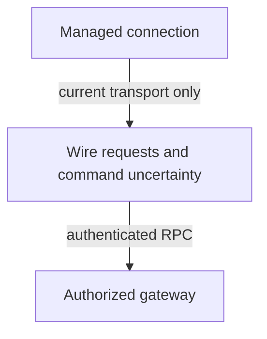

# Product client

The product client connects a Nessa surface to the gateway. It authenticates, sends requests and reports replies or uncertainty.

This page describes the TypeScript surface client. The separate Rust `nessa-client-core` owns device enrollment, private caches and [retained history reads](../sdk/runtime/an-authorized-receiver-reads-physical-history-without-opening-an-agent.md).

The gateway and SDK own the work after acceptance. Losing a client connection can end the wait without ending that work.

## Owner map

These boxes open related pages. They are parts of the system, rather than mutually exclusive runtime states.

## Browse this area

- [Wire requests and command uncertainty](commands.md)
- [Managed connection](connection.md)
