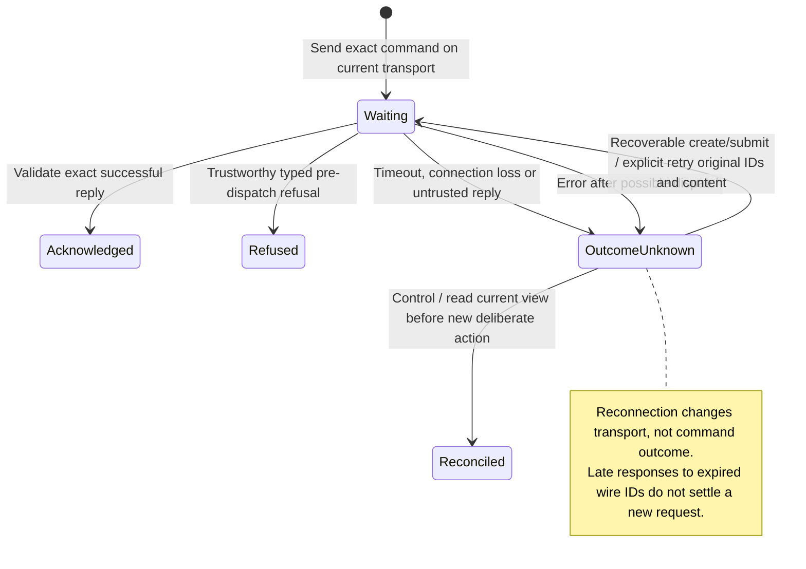

# Wire requests and command uncertainty

The client sends a request and waits for a reply. If the connection closes first, Nessa may already have accepted or acted on the request. The client reports that the outcome is unknown.

An explicit retry of conversation creation or a queued message keeps the original ID and content. It can recover the original answer instead of doing the work twice. Stop, reorder, approval answers, app tool calls and one-use downloads need different recovery: read the current state before taking another action. Reconnecting does not replay these commands.

## Further reading

[Source](../../../../packages/nessa-client/src/transport/wire-session.ts) · [Related source](../../../../packages/nessa-client/src/application/conversation-mutation-error.ts) · [Related tests](../../../../packages/nessa-client/src/presentation/conversation-api.test.ts)
