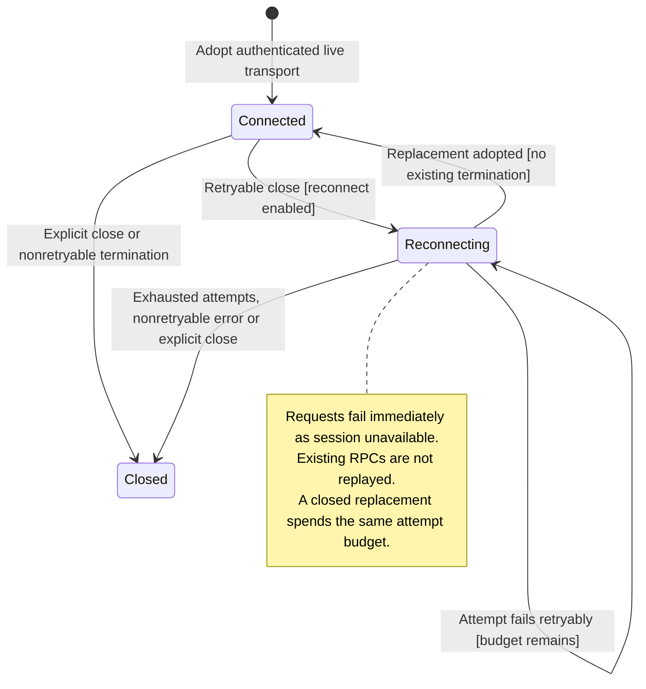

# Managed connection

The client opens a connection, checks that the gateway speaks the expected protocol, and authenticates before it becomes connected. A lost connection starts a limited retry process. Closing the client ends that process.

An old or already-closed connection cannot replace a working one. Reconnecting restores future subscriptions, but it does not recover every missed event or send earlier commands again. Work already accepted by the gateway may continue while the client is disconnected.

## Further reading

[Source](../../../../packages/nessa-client/src/application/managed-session.ts) · [Related source](../../../../packages/nessa-client/src/application/product-connect-flow.ts) · [Related tests](../../../../packages/nessa-client/src/application/managed-session.test.ts)
