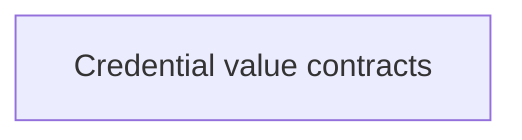

# Agent credential values

These shared values describe agent secrets and the storage scope they belong to. They check valid construction without reading or writing secrets.

Saving a key and checking whether an agent is ready belong to the native host and gateway, not this value library.

## Owner map

These boxes open related pages. They are parts of the system, rather than mutually exclusive runtime states.

## Browse this area

- [Credential value contracts](credentials-values.md)
