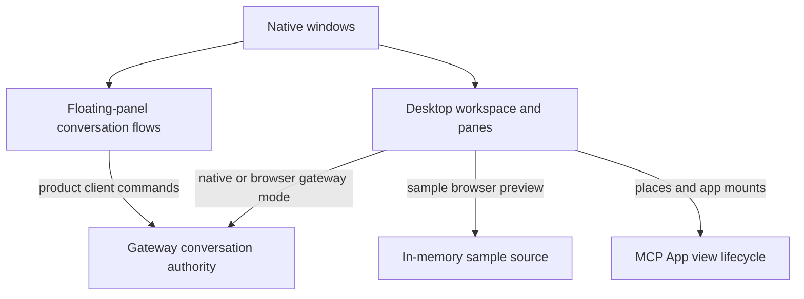

# Desktop and panel

Nessa has a floating chat panel and a desktop workspace. The panel and native desktop use the local gateway. A browser preview can use an existing gateway session or sample data.

Use Chat for gateway-backed conversation behavior and Desktop workspace for panes, focus, windows and widgets. Gateway-backed workspaces use server-provided MCP Apps. Sample workspaces keep the fixture app. See [connection modes](workspace/README.md#connection-modes).

## Owner map

These boxes open related pages. They are parts of the system, rather than mutually exclusive runtime states.

## Browse this area

- [Chat](chat/README.md)
- [Desktop workspace](workspace/README.md)
