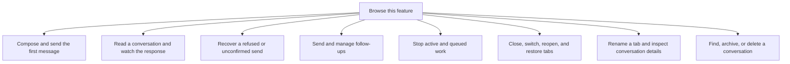

# Chat

The floating panel lets you send messages, follow work and reopen conversations through the real gateway. Each flow below follows one user action.

Acceptance is different from agent completion. Closing a tab is different from Stop or Delete. The desktop workspace has separate [connection modes](../workspace/README.md#connection-modes). Its sample controls do not prove gateway execution.

## Feature overview

These boxes open related pages. They are parts of the system, rather than mutually exclusive runtime states.

## Browse flows

- [Close, switch, reopen, and restore tabs](close-switch-reopen-and-restore-tabs.md)
- [Compose and send the first message](compose-and-send-the-first-message.md)
- [Find, archive, or delete a conversation](find-archive-or-delete-a-conversation.md)
- [Read a conversation and watch the response](read-a-conversation-and-watch-the-response.md)
- [Recover a refused or unconfirmed send](recover-a-refused-or-unconfirmed-send.md)
- [Rename a tab and inspect conversation details](rename-a-tab-and-inspect-conversation-details.md)
- [Send and manage follow-ups](send-and-manage-follow-ups.md)
- [Stop active and queued work](stop-active-and-queued-work.md)
