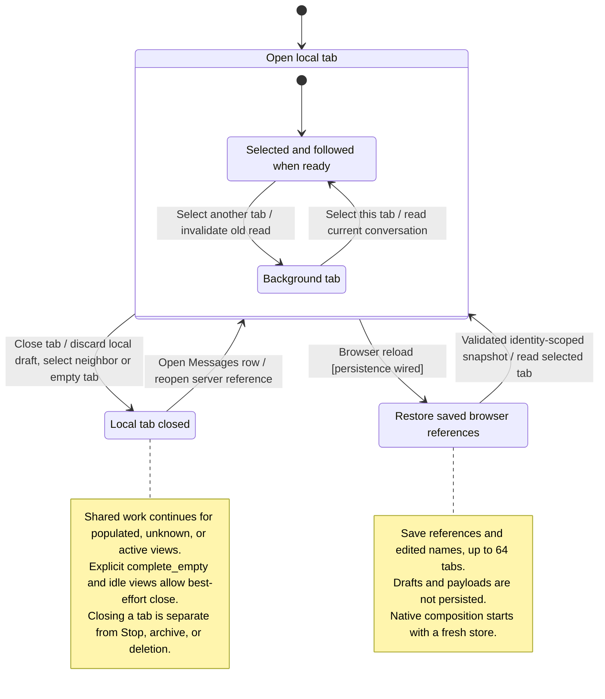

# close, switch, reopen, and restore tabs

Each tab keeps its own draft and selected conversation. Switching tabs shows that tab's content. Closing a tab usually removes the view while the conversation and agent work remain available.

The browser can restore a limited list of conversation IDs and local titles after reload, but it does not restore unsent drafts. A native window starts with fresh local tabs. Closing the last tab opens a replacement draft. Automatic remote cleanup requires a proven-empty idle conversation with no pending work; an ordinary prepared conversation does not automatically meet that condition.

## Further reading

[Source](../../../../../src/panel/application/tab-navigation.ts) · [Related source](../../../../../src/conversation/application/usecases/close-conversation.ts) · [Related tests](../../../../../crates/nessa-server/tests/conversation/projection.rs)
