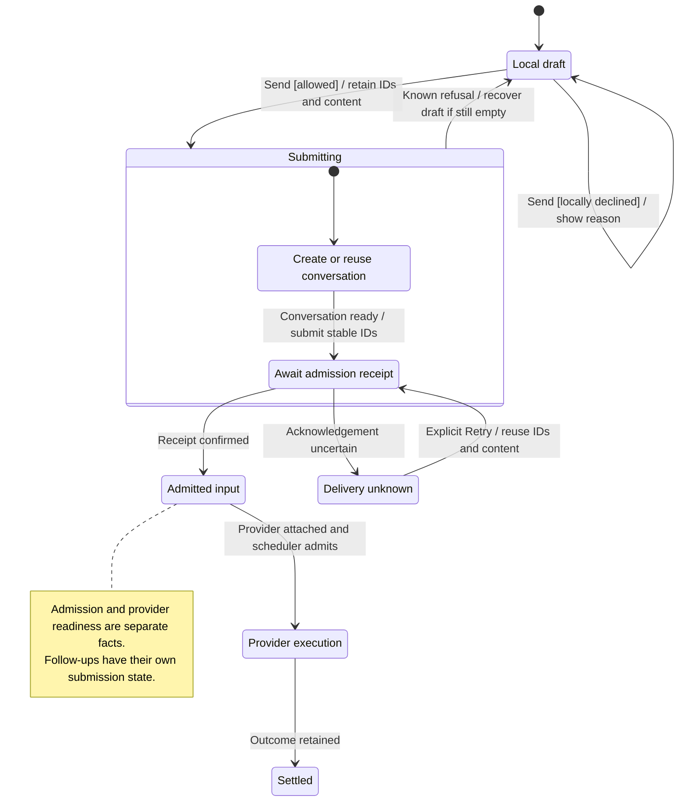
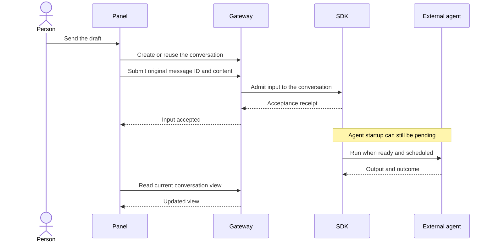

# compose and send the first message

Open a new conversation, choose a model and write a message. Enter sends it; Shift+Enter starts a Markdown block. Text can be empty when there are sendable attachments. The voice button has no working voice action yet.

Send keeps the original message identity and content while it waits for acceptance. Acceptance means Nessa owns the input. The external agent may still be starting. Pending or failed uploads, unsupported attachments and oversized text prevent sending. A model choice is fixed when the remote conversation is created; choosing another afterward starts a separate conversation.

## Who handles the send

## Further reading

[Source](../../../../../src/panel/ui/use-composer.ts) · [Related source](../../../../../src/conversation/ui/use-conversation.ts) · [Related tests](../../../../../src/panel/ui/use-composer.test.ts)
