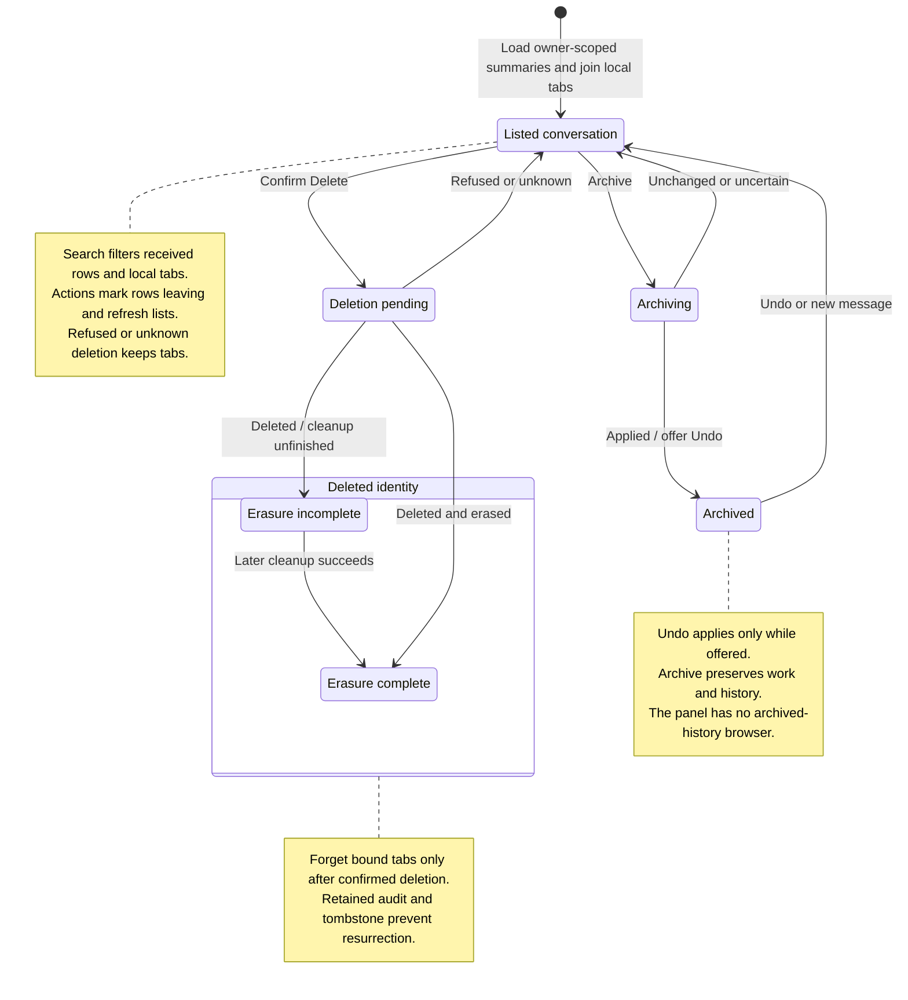

# find, archive, or delete a conversation

Messages combines server conversations with local tabs. Search filters that list. Opening a conversation selects its existing tab or reopens it from the gateway.

Archive hides a conversation and keeps its work and history. Undo is available only while offered; a new message can also unarchive it. Delete asks for confirmation, blocks further work under that identity, and starts cleanup. Tabs are removed after confirmed deletion. A refused or unknown deletion keeps them. Confirmed deletion can still have unfinished erasure, which Nessa retries while retaining its audit record.

## Further reading

[Source](../../../../../src/panel/application/messages-tab.ts) · [Related source](../../../../../src/conversation/ui/conversation-list.tsx) · [Related tests](../../../../../src/conversation/adapters/store/history.test.ts)
