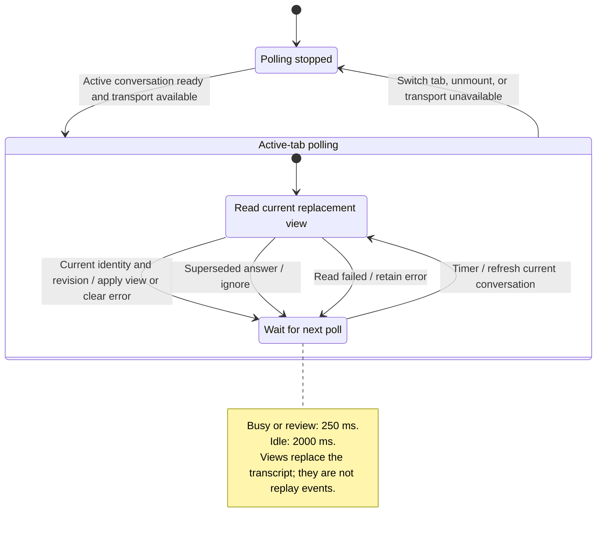

# read a conversation and watch the response

The panel periodically asks the gateway for the current conversation view. It replaces its previous view with the new one so text, work and approval requests stay together.

This view is a limited window into the conversation, not a complete history download. The panel reads committed output. The SDK can emit text before saving it; a crash can lose that text before the panel sees it. Switching or closing a tab ends that view's polling; it does not by itself stop the agent.

## Further reading

[Source](../../../../../src/conversation/ui/use-conversation.ts) · [Related source](../../../../../src/conversation/adapters/gateway/polling.ts) · [Related tests](../../../../../src/conversation/adapters/gateway/polling.test.ts)
