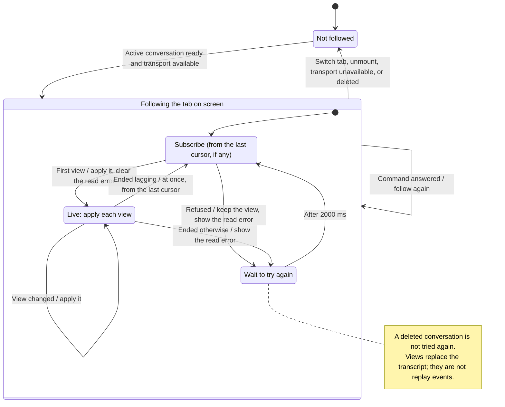

# read a conversation and watch the response

The tab on screen follows its conversation (`conversation.subscribe`): the gateway sends the current view when the follow opens and again whenever what it shows changes. The panel replaces its previous view with each one, so text, work and approval requests stay together. Nothing is asked on a timer.

This view is a limited window into the conversation, not a complete history download. The panel reads committed output. The SDK can emit text before saving it; a crash can lose that text before the panel sees it. Switching or closing a tab ends that view's follow; it does not by itself stop the agent.

After a command (send, control, stop), the tab is followed again, so the view it shows is read after the command was answered; a tab that is not on screen is read once instead. A view from the follow it replaced is dropped.

## Further reading

[Source](../../../../../src/conversation/ui/use-conversation.ts) · [Related source](../../../../../src/conversation/adapters/gateway/effects.ts) · [Related tests](../../../../../src/conversation/adapters/gateway/effects.test.ts) · [Design](../../../../design/record-subscriptions.md)
