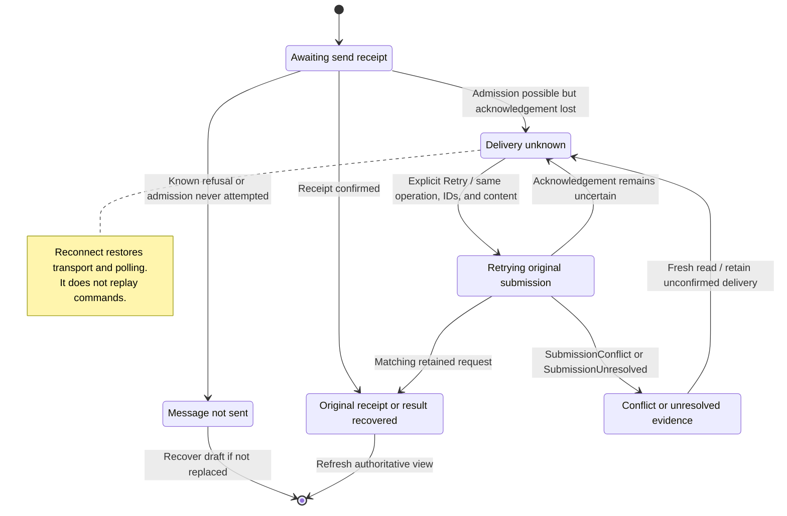
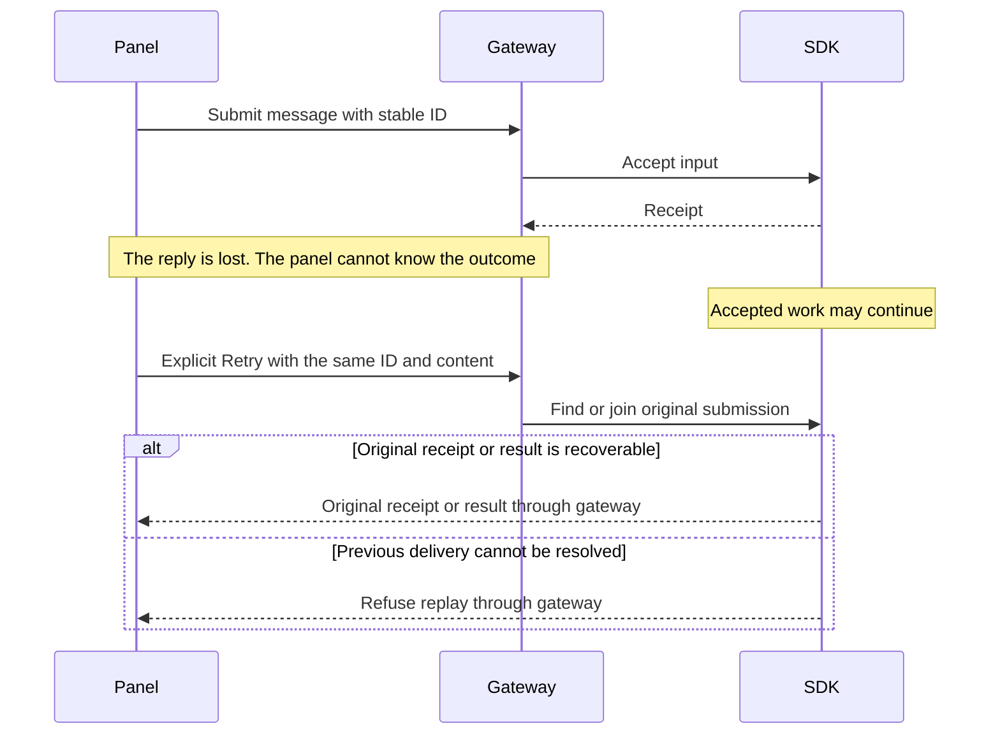

# recover a refused or unconfirmed send

A known refusal means the send was not accepted. Nessa can restore the unsent draft if doing so would not overwrite a newer draft.

A missing reply means the outcome is unknown. The original message may already be running. Explicit Retry uses its original IDs and content to recover the same submission. Reconnecting alone never resends it. Changing the content is a new action, not recovery of the old one.

## Recovering a lost reply

## Further reading

[Source](../../../../../src/conversation/adapters/store/slice.ts) · [Related source](../../../../../src/conversation/application/usecases/send-draft.ts) · [Related tests](../../../../../src/conversation/adapters/store/unsent.test.ts)
