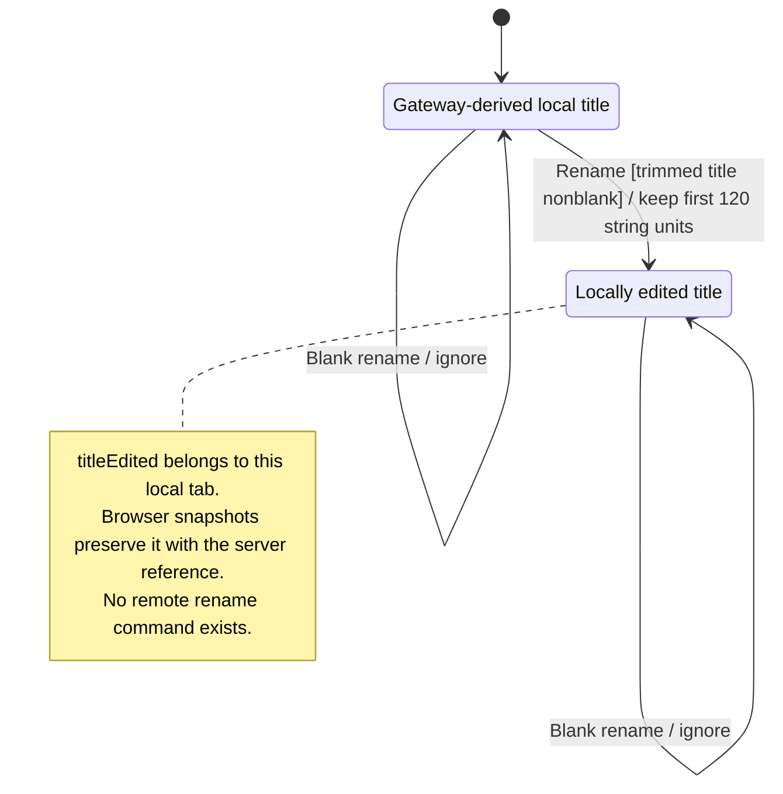

# rename a tab and inspect conversation details

Renaming changes the tab title in this window. It does not rename the server conversation or change the agent's stored context. Blank names are ignored.

Another surface may still show the gateway title. Local titles are limited to 120 JavaScript string units, so an emoji at the boundary may be split. That is a documented concern requiring a rendering check, not a reproduced failure here.

## Further reading

[Source](../../../../../src/panel/ui/app.tsx) · [Related source](../../../../../src/conversation/ui/conversation-details.tsx) · [Related tests](../../../../../src/conversation/ui/conversation-details.test.tsx)
