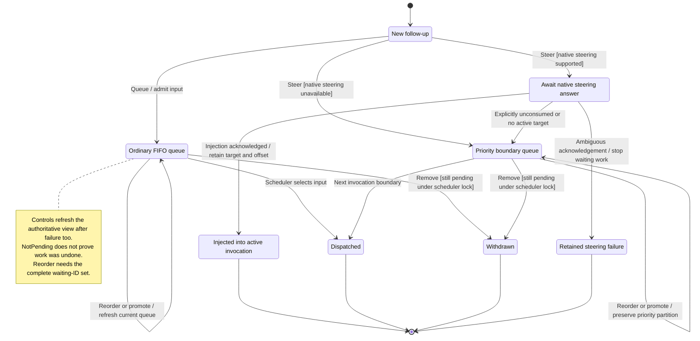

# send and manage follow-ups

A follow-up normally waits behind the current message. Nessa can keep up to 64 waiting inputs. You can withdraw or reorder waiting inputs before they start.

Steer changes how a follow-up is delivered. Boundary steering waits for a suitable execution boundary; it does not interrupt the active message. Native steering uses the agent's supported input channel. If delivery is uncertain, Nessa does not resend it as an ordinary message. Queue controls can finish while the agent is still starting.

## Further reading

[Source](../../../../../src/conversation/ui/use-conversation.ts) · [Related source](../../../../../src/panel/ui/app.tsx) · [Related tests](../../../../../src/conversation/adapters/store/reorder.test.ts)
