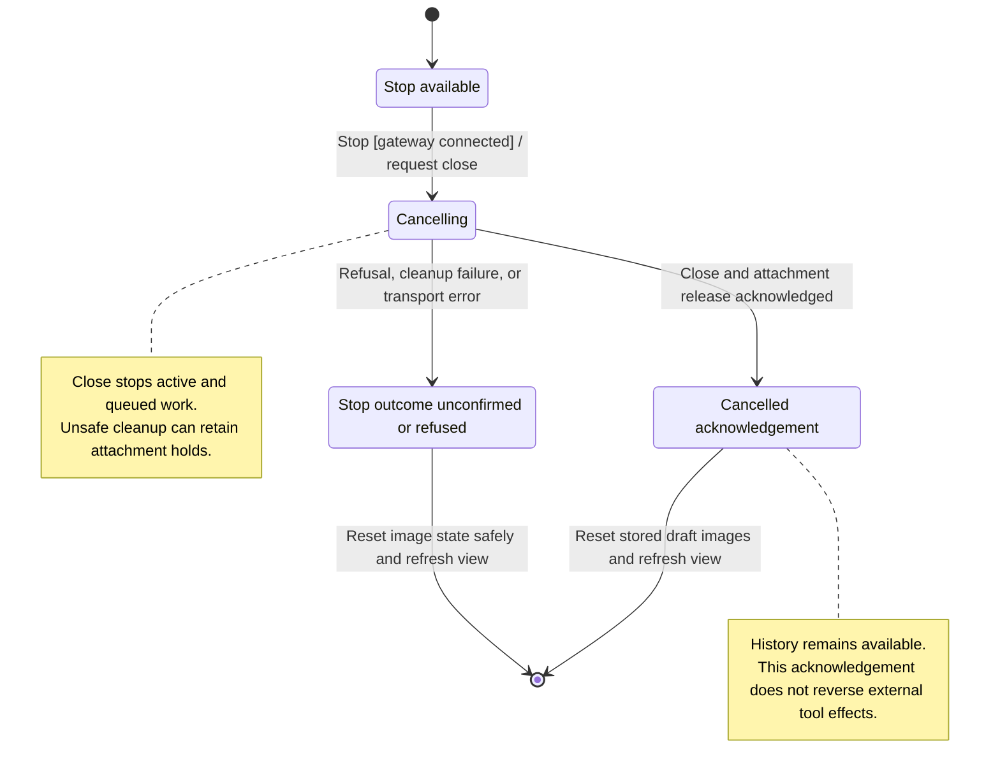

# stop active and queued work

Stop asks Nessa to end active work, cancel waiting inputs and close the conversation's connection to its agent. Saved history remains available for reopening.

Stopping requires the current gateway conversation and connection. It is separate from closing a tab or archiving a conversation. The agent's physical cleanup and attachment release have their own results, so a cancelled input alone does not prove every resource has been released.

## Further reading

[Source](../../../../../src/panel/ui/app.tsx) · [Related source](../../../../../src/conversation/adapters/store/slice.ts) · [Related tests](../../../../../src/conversation/adapters/store/control-failure.test.ts)
