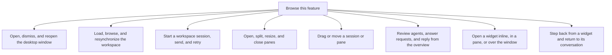

# Desktop workspace

The desktop organizes sessions into panes and provides search, focus, widgets and local preferences. Classic is its right-side conversation panel.

Layout can survive navigation in memory, but a restart does not restore every pane or draft. The connection mode determines whether actions reach the gateway or a sample source.

## Connection modes

| Where the desktop runs | Workspace source |
| --- | --- |
| Native desktop window | The local gateway, after host startup is ready. The window reads it and does not start or reconcile it. |
| Browser preview with `?gateway` | The gateway session already signed in on this origin. Sign-in and renewal belong to the panel browser surface. |
| Browser preview whose query names a seeded run | The in-memory seeded workspace. Not a gateway, and not the sample. |
| Other browser previews | In-memory sample sessions and scripted replies. These do not prove a provider ran. |

[Backend selection](../../../../../src/desktop/model/workspace-backend.ts) chooses the mode. [Composition](../../../../../src/desktop/dependencies.ts) supplies the corresponding workspace source. Gateway mode uses server-provided MCP Apps through the same client; sample mode keeps its fixture app. A missing sandbox is still an explicit cannot-show outcome.

## Feature overview

These boxes open related pages. They are parts of the system, rather than mutually exclusive runtime states.

## Browse flows

- [Discover subagents and experimental features](discover-subagents-and-experimental-features.md)
- [Drag or move a session or pane](drag-or-move-a-session-or-pane.md)
- [Expand and restore the Classic right panel](expand-and-restore-the-classic-right-panel.md)
- [Fold, reveal, and resize side columns](fold-reveal-and-resize-side-columns.md)
- [Follow focus and route keyboard actions](follow-focus-and-route-keyboard-actions.md)
- [Load, browse, and resynchronize the workspace](load-browse-and-resynchronize-the-workspace.md)
- [MCP App view lifecycle](mcp-app-view-lifecycle.md)
- [Open a widget inline, in a pane, or over the window](open-a-widget-inline-in-a-pane-or-over-the-window.md)
- [Open, dismiss, and reopen the desktop window](open-dismiss-and-reopen-the-desktop-window.md)
- [Open, search, and change desktop settings](open-search-and-change-desktop-settings.md)
- [Open, split, resize, and close panes](open-split-resize-and-close-panes.md)
- [Personalize the home header and composer](personalize-the-home-header-and-composer.md)
- [Pin, archive, or close a workspace session view](pin-archive-or-close-a-workspace-session-view.md)
- [Resize and refit the panel across displays](resize-and-refit-the-panel-across-displays.md)
- [Review agents, answer requests, and reply from the overview](review-agents-answer-requests-and-reply-from-the-overview.md)
- [Search sessions and jump with the quick switcher](search-sessions-and-jump-with-the-quick-switcher.md)
- [Start a workspace session, send, and retry](start-a-workspace-session-send-and-retry.md)
- [Step back from a widget and return to its conversation](step-back-from-a-widget-and-return-to-its-conversation.md)
- [Summon or dismiss the floating panel](summon-or-dismiss-the-floating-panel.md)
- [Switch the floating panel's surface](switch-the-floating-panel-s-surface.md)
- [Trace verified pull-request contributions](trace-verified-pull-request-contributions.md)
