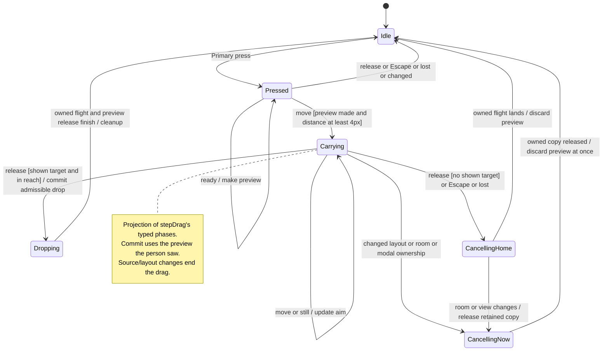

# drag or move a session or pane

Dragging a session previews where it will open. Dragging a pane previews where its content will move. The layout at the time of the drop determines the available targets.

Dropping in the middle swaps content; dropping at a supported edge splits a pane. Side columns are not pane drop targets. Keyboard moves use the same layout rules as dragging.

## Further reading

[Source](../../../../../src/desktop/workspace/adapters/dom/split-panes-drag.ts) · [Related source](../../../../../src/desktop/split-panes/adapters/dom/drag.ts) · [Related tests](../../../../../src/desktop/split-panes/adapters/dom/drag.test.tsx)
