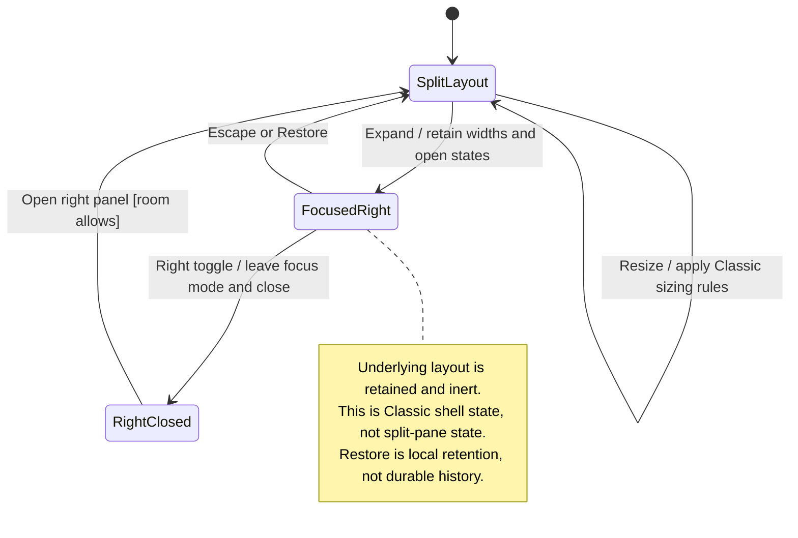

# expand and restore the Classic right panel

Classic is a right-side panel inside the desktop window. Expanding it temporarily uses more of the workspace while remembering the previous widths.

Escape restores the previous layout. Toggling Classic closes that panel. It is an app layout change, not a new operating-system window.

## Further reading

[Source](../../../../../src/desktop/ui/desktop-app.tsx) · [Related source](../../../../../src/desktop/adapters/use-sidebar-layout.ts) · [Related tests](../../../../../src/desktop/adapters/sidebar-sizing.test.ts)
