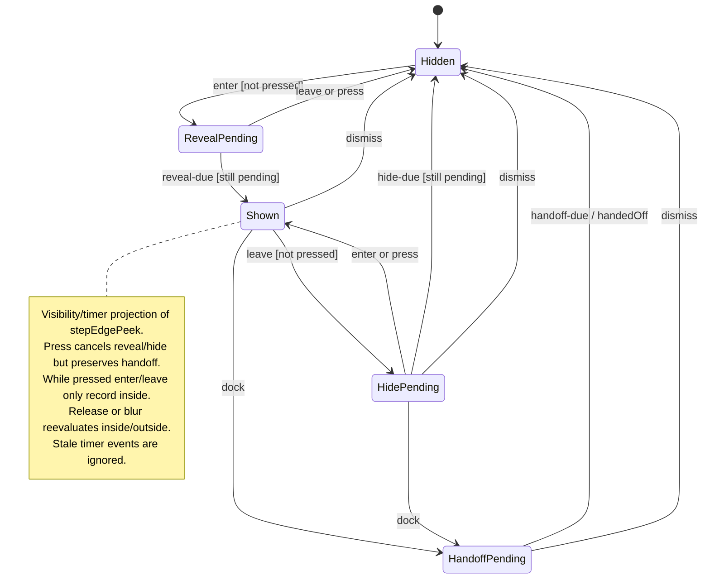

# fold, reveal, and resize side columns

Side columns can be resized or folded to make room for the workspace. Reveal brings a folded column back into view without permanently changing the layout.

At the left edge, a temporary overlay can show the column. Leaving it starts a short delay before it hides. Keyboard controls and available screen width also affect which columns can remain open.

## Further reading

[Source](../../../../../src/desktop/workspace/application/usecases/navigation.ts) · [Related source](../../../../../src/desktop/workspace/model/window-fit.ts) · [Related tests](../../../../../src/desktop/workspace/application/usecases/navigation.test.ts)
