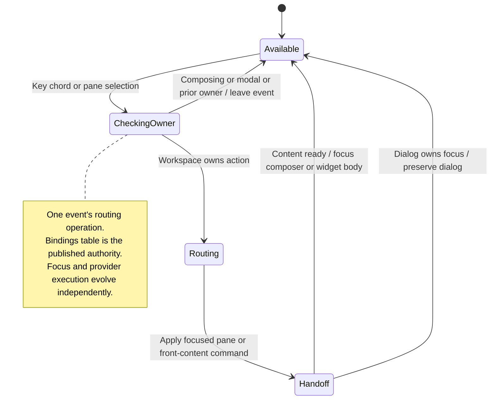

# follow focus and route keyboard actions

Keyboard actions follow the current focus. A pane, input or open widget can handle an action before the wider workspace handles it.

Nessa uses the same published shortcuts for keyboard and visible controls. Focus determines the target, so a key should not accidentally act on a different conversation or pane.

## Further reading

[Source](../../../../../src/desktop/workspace/ui/layouts/shortcuts.ts) · [Related source](../../../../../src/desktop/workspace/adapters/dom/shortcuts.ts) · [Related tests](../../../../../src/desktop/workspace/adapters/dom/focus.test.tsx)
