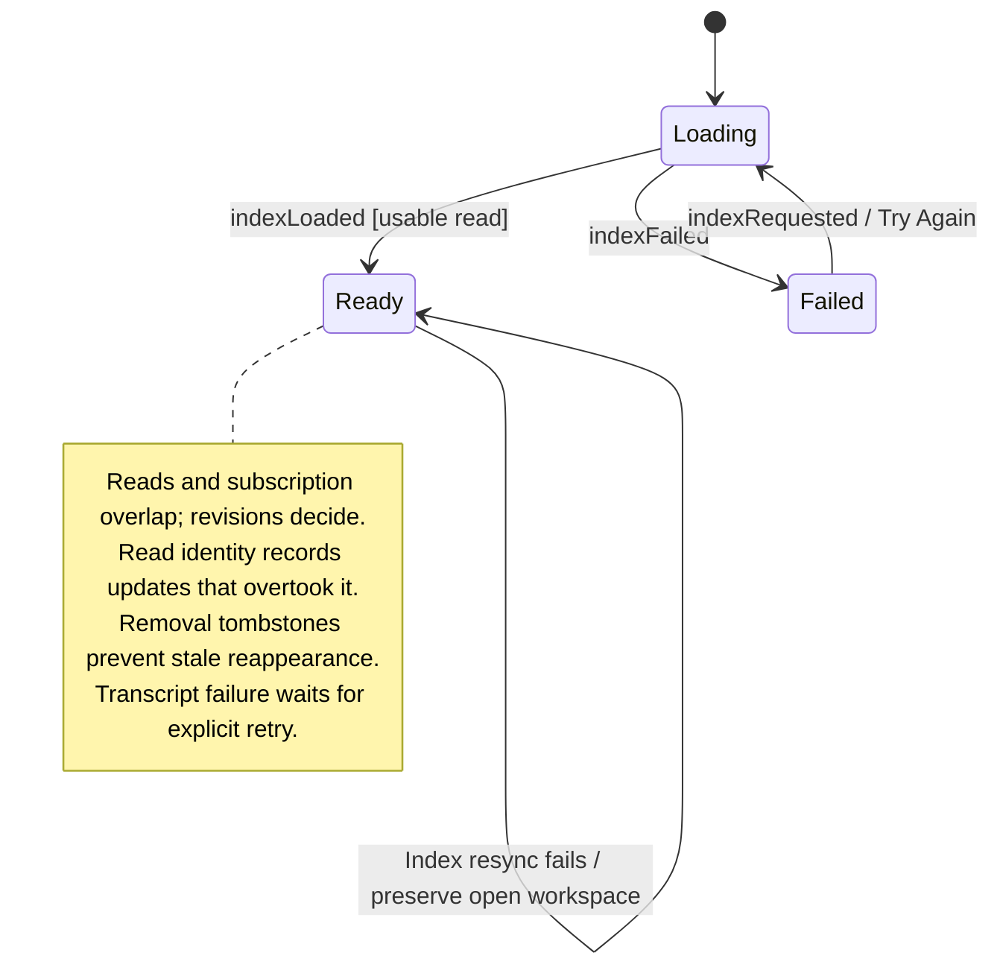

# load, browse, and resynchronize the workspace

The desktop loads a workspace source and uses it to show sessions and summaries. Refreshing replaces those summaries while preserving valid local selections.

The selected [connection mode](README.md#connection-modes) supplies gateway data, a seeded workspace, or an in-memory sample. Some preferences persist, but the complete arrangement of panes does not. Losing a local view is different from deleting a server conversation.

## Further reading

[Source](../../../../../src/desktop/workspace/application/ports.ts) · [Related source](../../../../../src/desktop/dependencies.ts) · [Related tests](../../../../../src/desktop/workspace/application/usecases/updates.test.ts)
