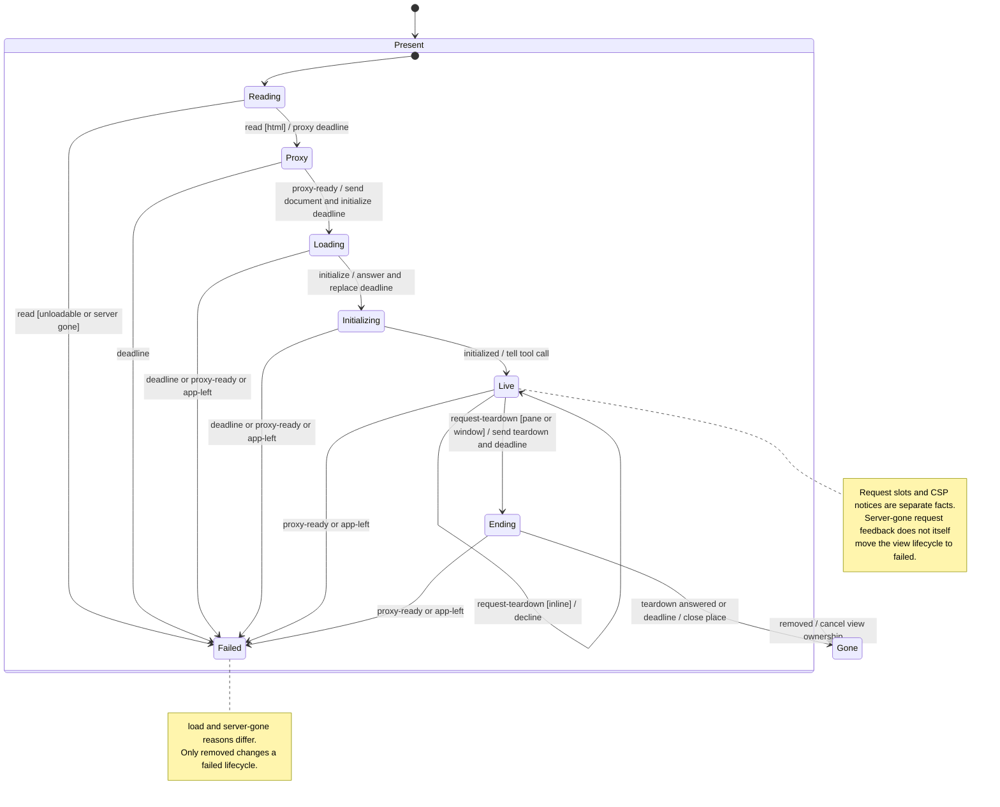
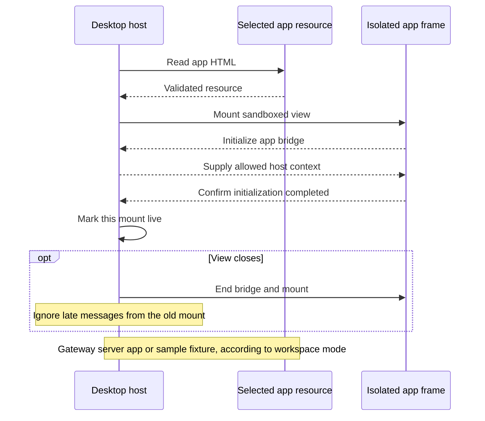

# MCP App view lifecycle

An MCP App is an interactive view supplied by a tool. Nessa reads its HTML, loads it in an isolated frame, and waits for the app to initialize before showing it as live.

Closing the view ends its bridge and ignores late replies. Moving or reopening must use the correct mount identity. Gateway-backed workspaces read app resources and call tools through their workspace client. Sample workspaces use a fixture app. The frame handshake does not grant permission to call every tool.

## Opening the view

## Further reading

[Source](../../../../../src/desktop/widgets/app/model/lifecycle.ts) · [Related source](../../../../../src/desktop/widgets/app/application/bridge.ts)
