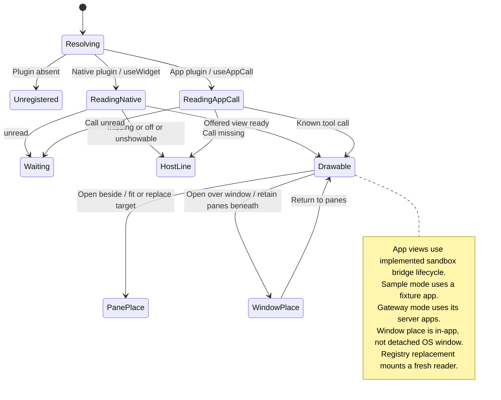

# open a widget inline, in a pane, or over the window

A widget can appear inside a message, in a pane, or over the desktop window. Opening it chooses one of these places while retaining the conversation it came from.

Native widgets and MCP Apps use different content sources. Gateway mode uses server-provided apps; sample mode uses a fixture. See [connection modes](README.md#connection-modes). A view over the window is still inside Nessa, not a separate operating-system window.

## Further reading

[Source](../../../../../src/desktop/widgets/application/registry.ts) · [Related source](../../../../../src/desktop/widgets/ui/plugin.ts) · [Related tests](../../../../../src/desktop/widgets/application/registry.test.ts)
