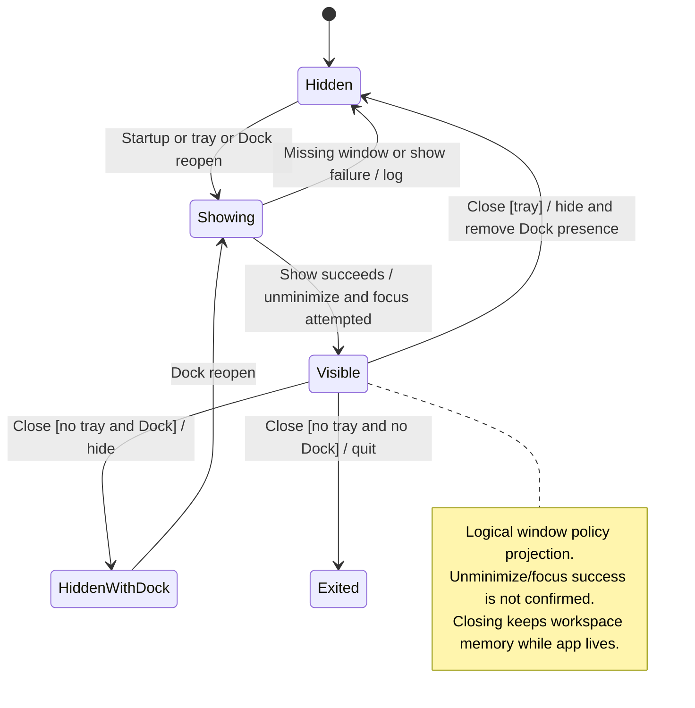

# open, dismiss, and reopen the desktop window

Opening the desktop shows its native window and restores its local workspace view. Dismissing hides that surface according to the native window policy.

Tray and Dock actions can bring it back. Window visibility does not say whether agent work stopped or whether a conversation was deleted.

## Further reading

[Source](../../../../../src-tauri/src/desktop_window.rs) · [Related source](../../../../../src-tauri/src/main.rs)
