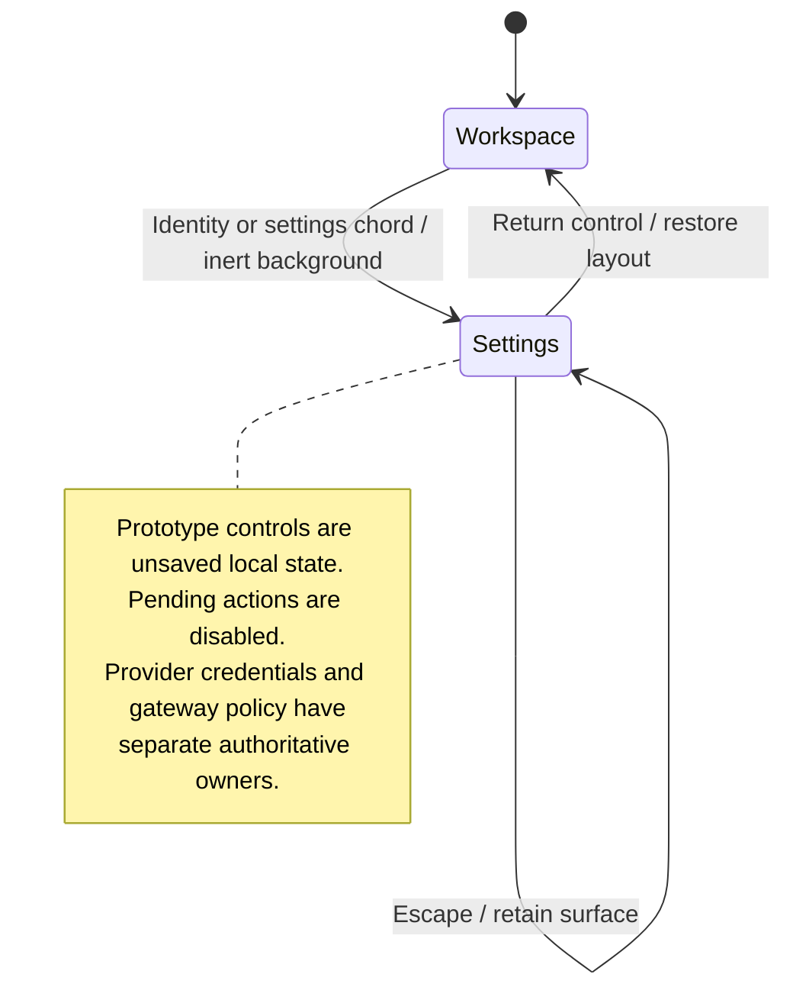

# open, search, and change desktop settings

Settings opens inside the desktop. Search helps find a preference, and changing a working control updates its local setting.

Some catalogue entries are prototypes or unavailable controls. Their presence does not mean they save a provider credential or change an agent. Escape follows the settings view's return behavior.

## Further reading

[Source](../../../../../src/desktop/ui/desktop-window.tsx) · [Related source](../../../../../src/desktop/settings/ui/settings-view.tsx) · [Related tests](../../../../../src/desktop/settings/ui/settings-view.test.tsx)
