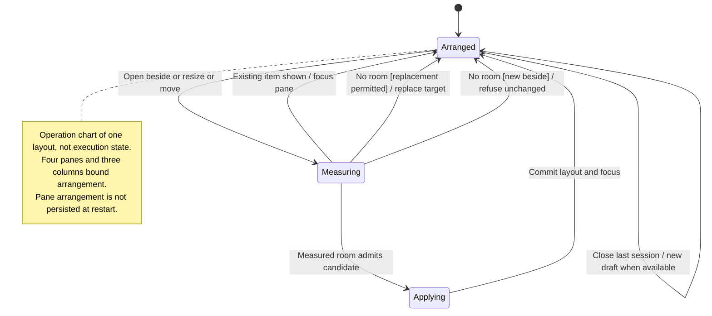

# open, split, resize, and close panes

Opening beside a pane first looks for space on the right, then below. When there is no room, it replaces the current content where that action allows replacement.

Splitting and resizing respect the available workspace. A new draft that must open beside another pane is refused when there is no room. Closing a pane removes its view, not its conversation.

## Further reading

[Source](../../../../../src/desktop/workspace/application/usecases/panes.ts) · [Related source](../../../../../src/desktop/workspace/adapters/store/commands.ts) · [Related tests](../../../../../src/desktop/workspace/application/usecases/panes.test.ts)
