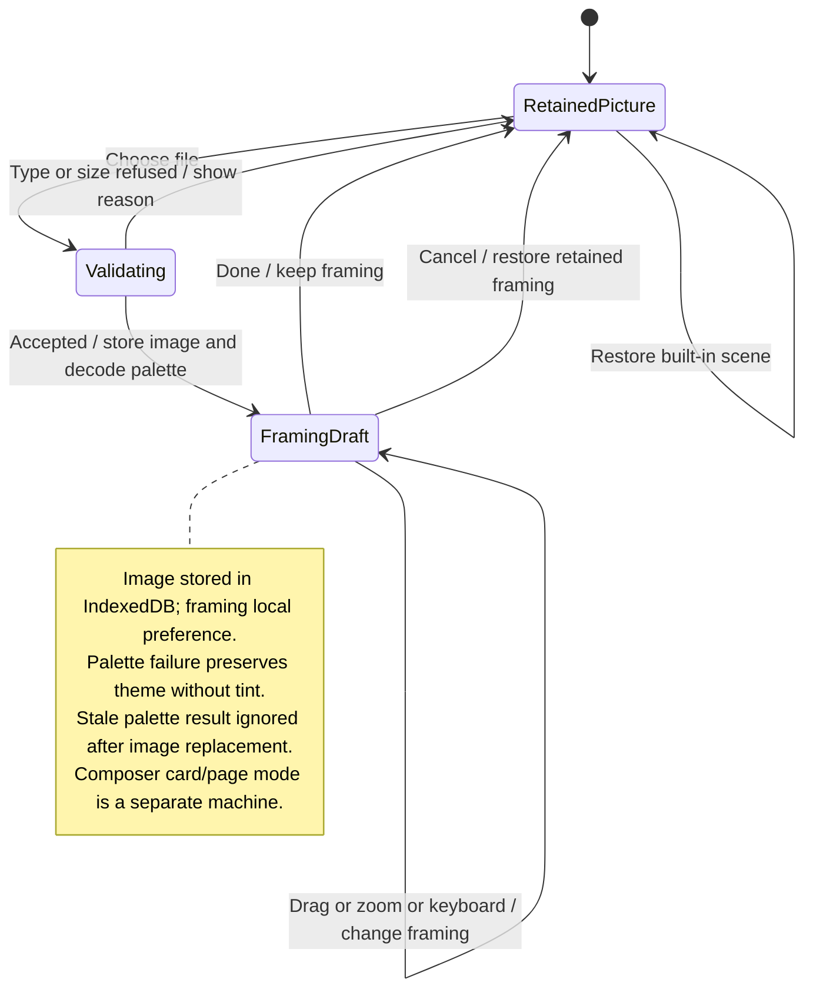

# personalize the home header and composer

You can choose a home image, adjust its focal position and change local composer appearance. Cancelling an edit restores the previous choice.

Images are stored locally in the browser's database and are limited to 25 MB. Animated images play for the focused pane. These preferences do not change agent configuration or server history.

## Further reading

[Source](../../../../../src/desktop/ui/header-art.tsx) · [Related source](../../../../../src/desktop/ui/header-picture.tsx) · [Related tests](../../../../../src/desktop/model/header-image.test.ts)
