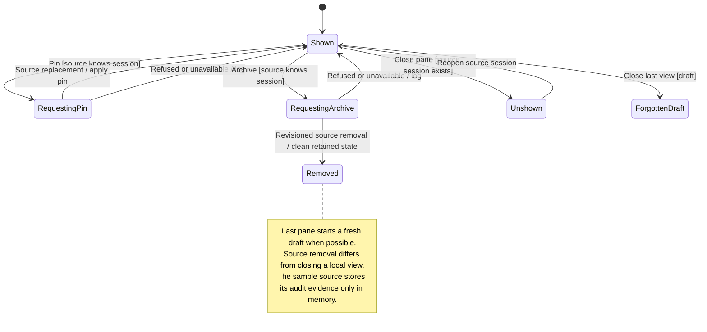

# pin, archive, or close a workspace session view

Pinning and archiving use the current workspace source. The view updates from that source's answer, rather than assuming the action succeeded.

Closing a pane removes its view. It does not delete a remote session. A local draft can be forgotten when nothing still holds it. In [sample mode](README.md#connection-modes), these actions remain fixture behavior. Gateway mode delegates remote actions to its workspace source.

## Further reading

[Source](../../../../../src/desktop/workspace/ui/session-actions.tsx) · [Related source](../../../../../src/desktop/workspace/adapters/store/commands.ts) · [Related tests](../../../../../src/desktop/workspace/model/session-lifecycle.test.ts)
