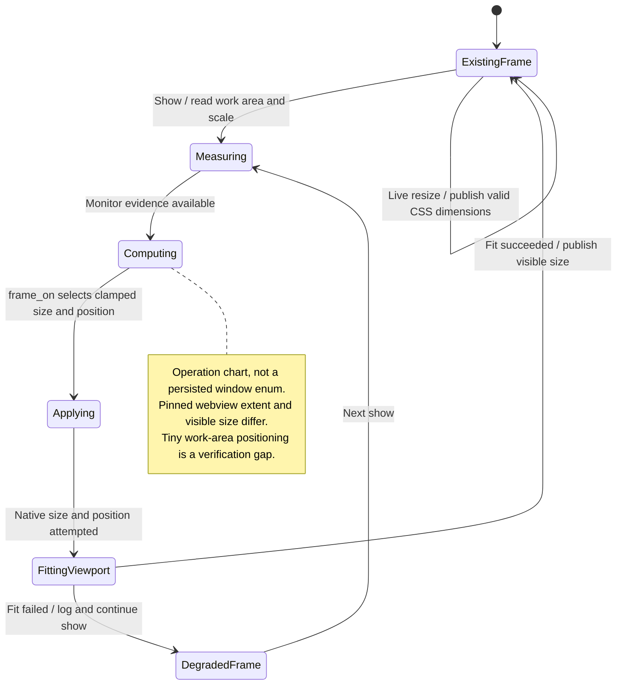

# resize and refit the panel across displays

The floating panel remembers its size and fits within the current display's usable area. Moving across displays can change the space available to it.

Each show checks the work area again. Resizing preserves the panel's native placement rules instead of letting a stale size put it beyond the screen.

## Further reading

[Source](../../../../../src-tauri/src/panel.rs) · [Related source](../../../../../src-tauri/src/platform/macos/viewport.rs) · [Related tests](../../../../../src/panel/adapters/panel-frame.test.ts)
