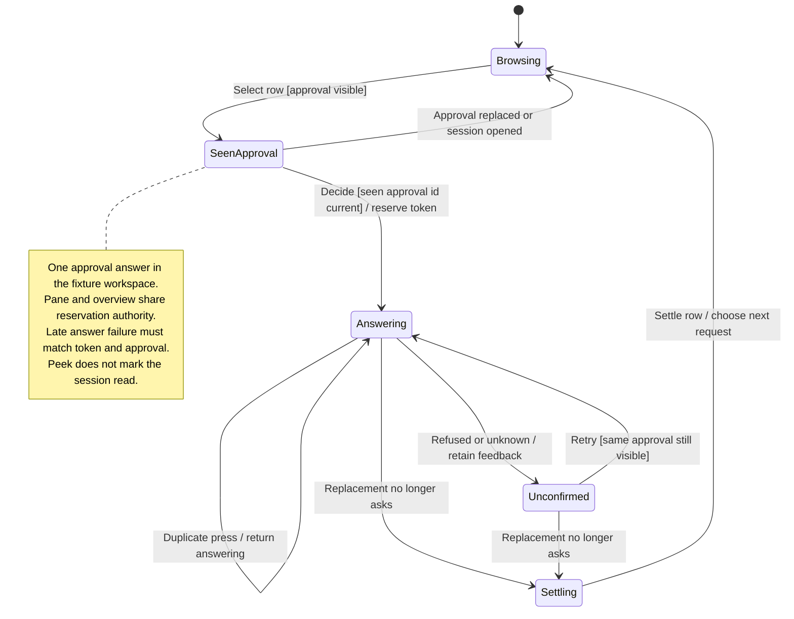

# review agents, answer requests, and reply from the overview

The overview groups sessions that need your attention, are running, or have finished. Opening one takes you to its conversation or waiting request.

Answers and replies use the selected workspace source. In [sample mode](README.md#connection-modes), these cards do not prove that live subagents were started or that a provider received an approval.

## Further reading

[Source](../../../../../src/desktop/workspace/ui/overview/overview.tsx) · [Related source](../../../../../src/desktop/workspace/ui/overview/session-peek.tsx) · [Related tests](../../../../../src/desktop/workspace/ui/overview/overview.test.tsx)
