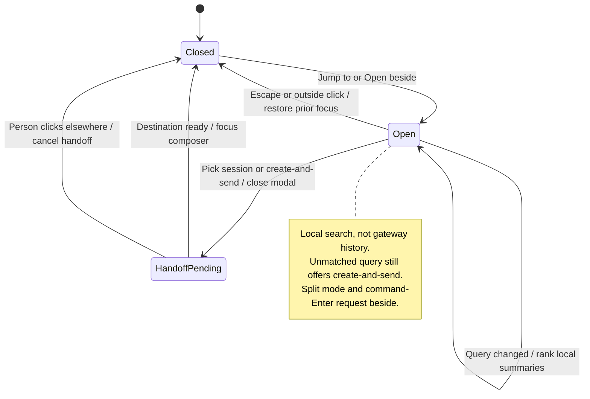

# search sessions and jump with the quick switcher

The quick switcher searches the sessions already available in the workspace. Selecting a result focuses or opens that session.

It uses local matching rather than searching the gateway's complete history. A session absent from this source cannot appear just because it exists elsewhere.

## Further reading

[Source](../../../../../src/desktop/workspace/model/session-search.ts) · [Related source](../../../../../src/desktop/workspace/ui/quick-switcher/quick-switcher.tsx) · [Related tests](../../../../../src/desktop/workspace/model/session-search.test.ts)
