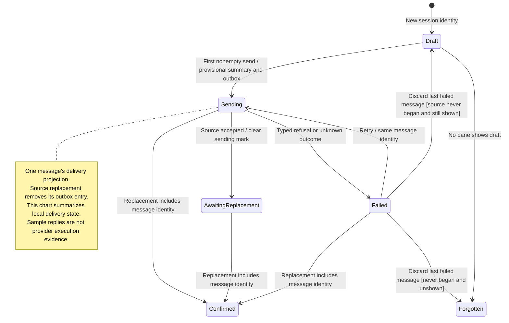

# start a workspace session, send, and retry

A new desktop session begins as a local draft. Sending keeps a stable input ID so a retry can refer to the same message.

The selected [connection mode](README.md#connection-modes) decides where the message goes. Gateway mode sends through the workspace client; sample mode produces scripted replies. A sample reply does not prove a provider ran.

## Further reading

[Source](../../../../../src/desktop/workspace/application/usecases/sessions.ts) · [Related source](../../../../../src/desktop/workspace/model/session-lifecycle.ts) · [Related tests](../../../../../src/desktop/workspace/application/usecases/sessions.test.ts)
