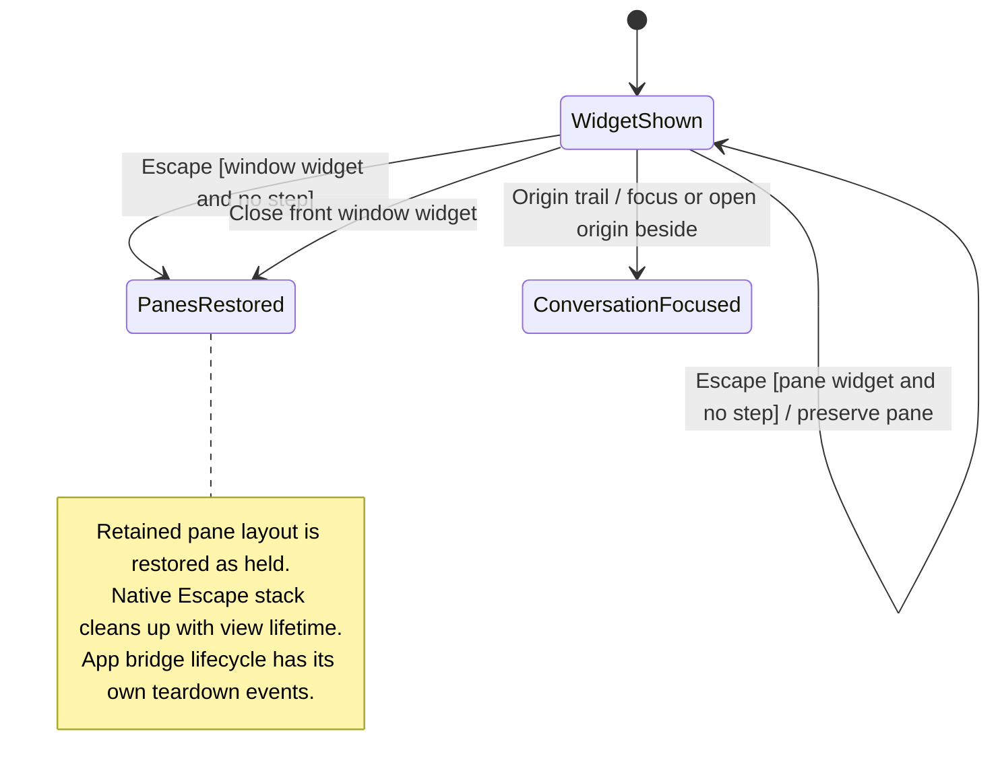

# step back from a widget and return to its conversation

Escape first closes the innermost widget detail. Further steps return toward the widget's previous view and originating conversation.

A view over the window can return to its pane. A widget already in a pane is not closed by that same Escape rule. Nessa keeps the origin so stepping back does not send you to another conversation.

## Further reading

[Source](../../../../../src/desktop/workspace/adapters/dom/widget-escape.ts) · [Related source](../../../../../src/desktop/widgets/application/escape-stack.ts) · [Related tests](../../../../../src/desktop/workspace/adapters/dom/widget-escape.test.tsx)
