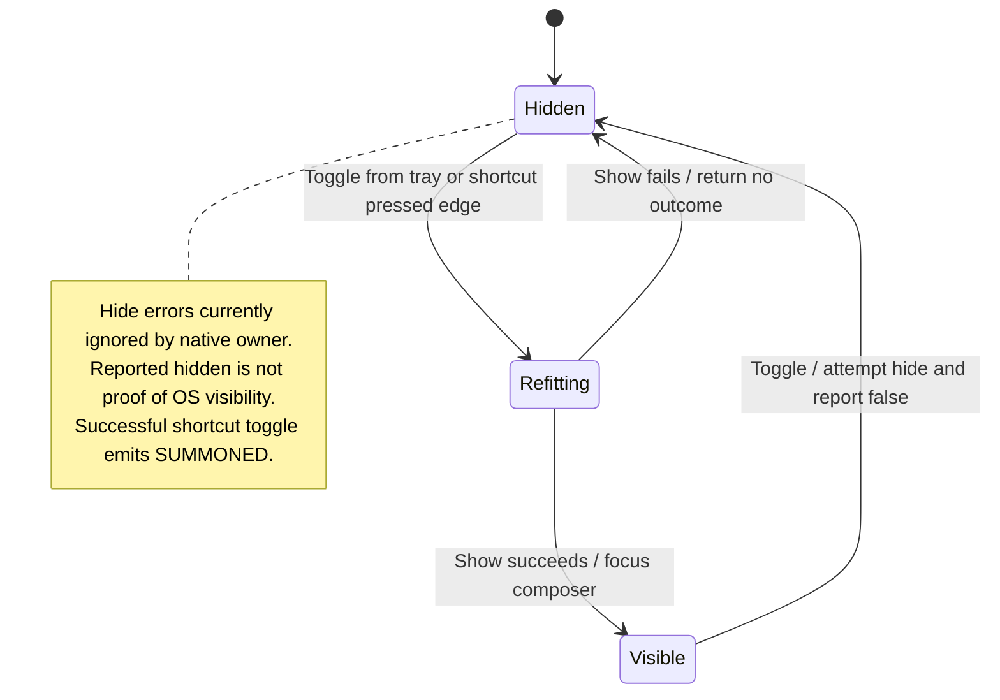

# summon or dismiss the floating panel

The tray action or configured global shortcut shows and hides the floating panel. The native host handles the pressed edge so one key press produces one toggle.

The shortcut belongs to the configured Nessa stage. Showing the panel does not create a new conversation, and hiding it does not stop existing work.

## Further reading

[Source](../../../../../src-tauri/src/tray.rs) · [Related source](../../../../../src-tauri/src/shortcut.rs) · [Related tests](../../../../../src/host/window.test.ts)
