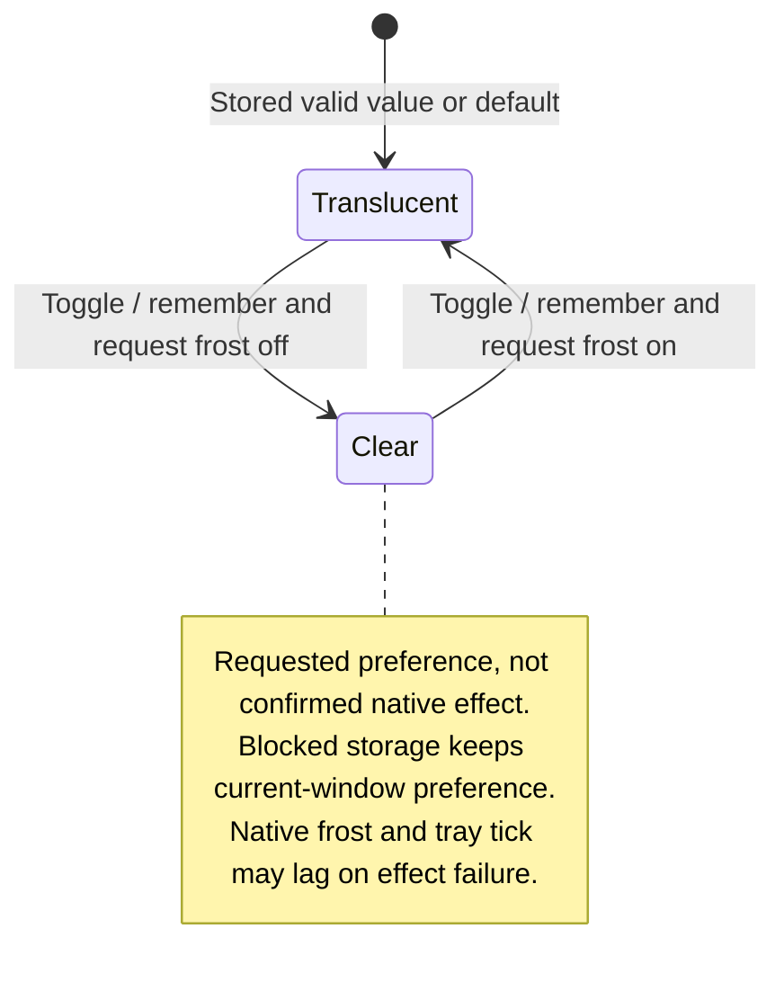

# switch the floating panel's surface

The floating panel can switch its local appearance. The host applies the selected surface style to that window.

This preference is separate from the desktop theme. It changes how the panel looks, not the state of its conversations or agents.

## Further reading

[Source](../../../../../src/panel/adapters/surface.ts) · [Related source](../../../../../src/panel/adapters/host-panel.ts) · [Related tests](../../../../../src/host/window.test.ts)
