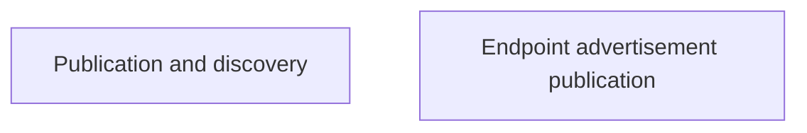

# Gateway endpoint discovery

These pages explain how Nessa publishes and finds the address of its running gateway. Callers check the live gateway against the private address record before trusting its identity.

Finding the gateway is separate from authenticating to it. Writing the record is also separate from confirming that the write is durable.

## Owner map

These boxes open related pages. They are parts of the system, rather than mutually exclusive runtime states.

## Browse this area

- [Publication and discovery](endpoint-discovery.md)
- [Endpoint advertisement publication](endpoint-publication.md)
