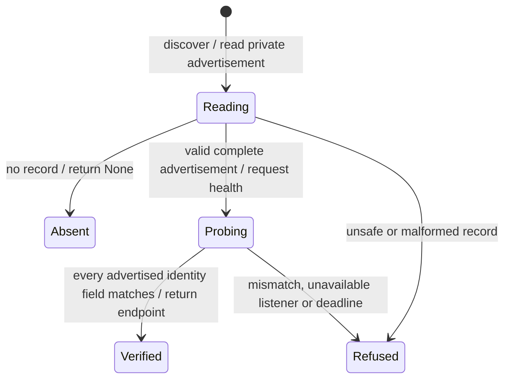

# Publication and discovery

A caller needs the address of the gateway that is actually running. It reads Nessa's private address record, then checks the live gateway against that record.

The address, instance and process identity must agree. When managed-service details are present, they must form a complete matching set. This confirms which gateway was found; authentication is still required. Some callers can fall back when no discovery record exists, so absence is not itself a successful validation.

## Further reading

[Source](../../../../crates/nessa-gateway-endpoint/src/application/publish.rs) · [Related source](../../../../crates/nessa-gateway-endpoint/src/infrastructure/file.rs)
