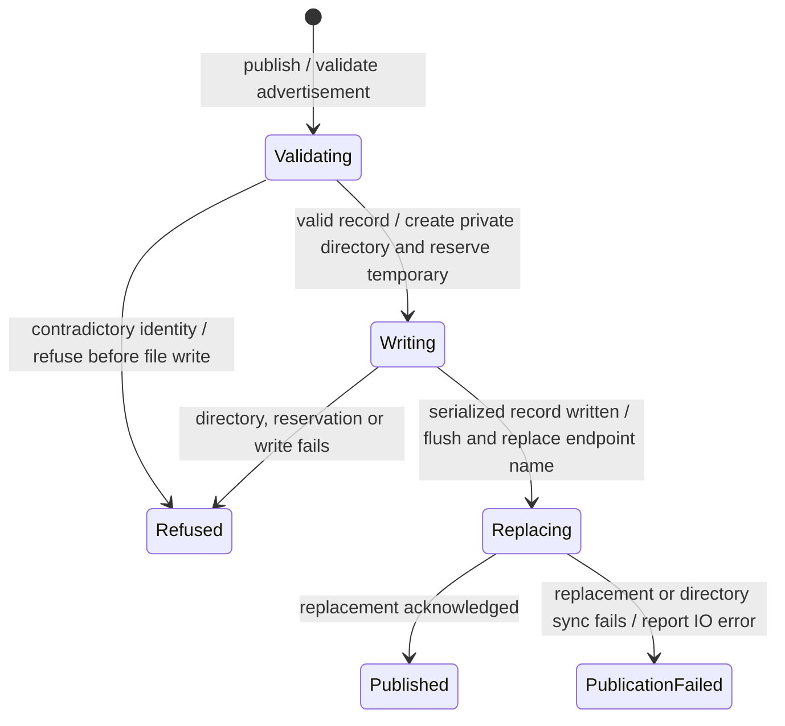

# Endpoint advertisement publication

The gateway publishes its actual listening address after it has started. Other Nessa components can use that private record to find it.

Incomplete or contradictory identity details are refused before writing. Replacing the file and confirming it was durably saved are separate steps. If the final directory sync fails, the new file may already be in place. Cleanup must not remove a newer gateway's record.

## Further reading

[Source](../../../../crates/nessa-gateway-endpoint/src/infrastructure/file.rs)
