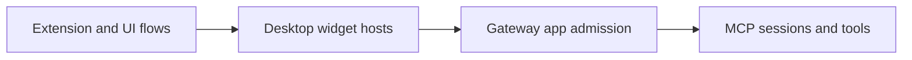

# Extensions and UI integration

Extensions can give tools interactive views, and Nessa UI provides reusable app components. The gateway owns tool permission; the desktop owns the displayed app and its host bridge.

Examples and sibling packages have their own verification limits. The desktop connects server apps in gateway mode and keeps fixture apps in sample mode. See [connection modes](../desktop/workspace/README.md#connection-modes).

## Owner map

These boxes open related pages. They are parts of the system, rather than mutually exclusive runtime states.

## Browse this area

- [Extensions and UI](ui/README.md)
