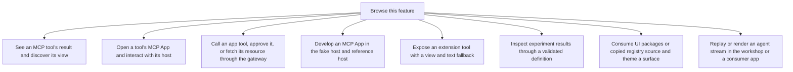

# Extensions and UI

These flows explain how a tool offers an app, how a host displays it, and how an app asks to use tools. They also cover reusable UI packages and developer examples.

Keep the boundaries visible: gateway-backed workspaces use the gateway tool APIs, while sample workspaces use fixture apps. A component catalogue or example is not proof of a shipped feature.

## Feature overview

These boxes open related pages. They are parts of the system, rather than mutually exclusive runtime states.

## Browse flows

- [Call an app tool, approve it, or fetch its resource through the gateway](call-an-app-tool-approve-it-or-fetch-its-resource-through-the-gateway.md)
- [Consume UI packages or copied registry source and theme a surface](consume-ui-packages-or-copied-registry-source-and-theme-a-surface.md)
- [Develop an MCP App in the fake host and reference host](develop-an-mcp-app-in-the-fake-host-and-reference-host.md)
- [Discover reusable UI families for an application](discover-reusable-ui-families-for-an-application.md)
- [Expose an extension tool with a view and text fallback](expose-an-extension-tool-with-a-view-and-text-fallback.md)
- [Inspect experiment results through a validated definition](inspect-experiment-results-through-a-validated-definition.md)
- [Open a tool's MCP App and interact with its host](open-a-tool-s-mcp-app-and-interact-with-its-host.md)
- [Replay or render an agent stream in the workshop or a consumer app](replay-or-render-an-agent-stream-in-the-workshop-or-a-consumer-app.md)
- [See an MCP tool's result and discover its view](see-an-mcp-tool-s-result-and-discover-its-view.md)
