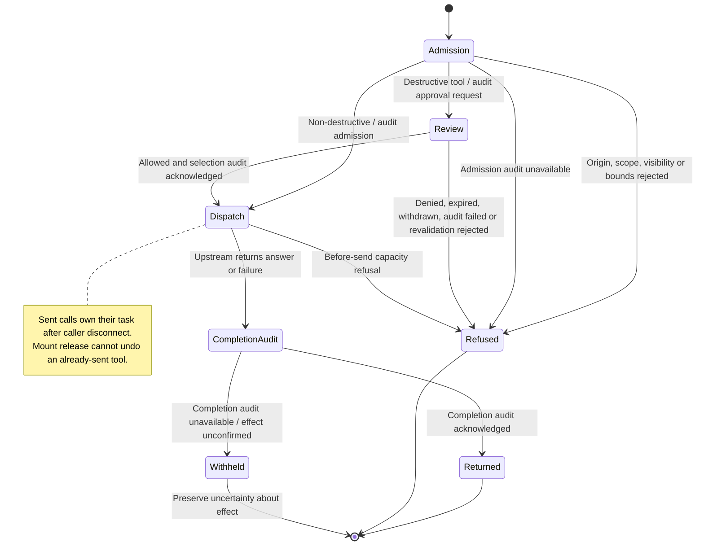
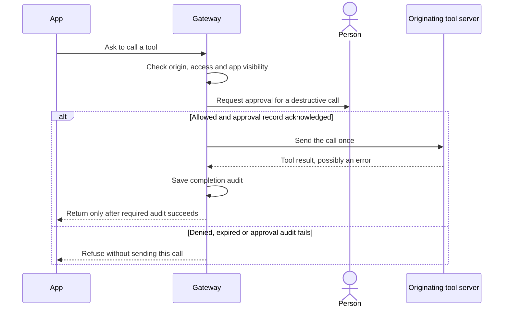

# call an app tool, approve it, or fetch its resource through the gateway

An app inside a conversation can ask Nessa to call a tool. Nessa checks that the app is allowed to use it, asks for approval when needed, and saves a record before returning the result.

Gateway-backed desktop apps use this flow through the workspace client. The sample app retains fixture wiring. Tool approval and the app mount lifecycle remain separate.

The chart follows one tool request from its checks to its reply. Ending the request does not prove that a tool's changes were undone. Reading an app resource also uses access checks, then adds the single-use download described below.

The state names describe steps in the code, rather than a saved state-machine value. See the [design tables](../../../../design/mcp-app-calls.md) for the detailed ordering.

## Call admission

Nessa checks that the caller can access the conversation and that the app reference identifies a tool with a UI in that conversation. The app uses the caller's credential; it does not sign in separately. Knowing a conversation ID is not enough to gain access.

Each open copy of an app is tracked separately. For example, an inline app and the same app opened in a pane have different identities. That keeps their approval requests and downloads from being confused.

## Admission refusal rules

Nessa refuses the request before calling the tool if the app's origin, target or input does not pass the checks. The app must come from a known tool in this conversation, use that tool's server, and request a tool available to apps. Its input must fit the limits.

A closed app, an unavailable tool session or a full call queue can also stop the request. The checks grouped on this arrow are separate reasons for refusal. Passing one does not bypass the others.

## Destructive review

Nessa asks for approval before a call that might change or delete something. A tool whose safety information is missing also requires approval. The person sees Allow and Deny choices and the input that would be sent.

The request must be recorded before it is shown. If that record cannot be saved, Nessa shows no approval request and makes no tool call. App approvals are separate from the agent's own approval settings.

## Direct dispatch admission

A tool classified as non-destructive can proceed without asking the person for approval. Nessa still checks the caller's access, the app reference, the input and whether the app is open.

Nessa records that the call was accepted before handing it to the tool connection. If that record cannot be saved, the request stops and nothing is sent.

## Approval before dispatch

Choosing Allow lets Nessa continue checking the call. It first saves who approved it, then checks again that the tool and app are still available and still require the approval that was given.

If those facts changed while the person was deciding, Nessa refuses the call instead of using an outdated approval. Once an answer has been accepted, a later denial or timeout cannot replace it.

## Review refusal and withdrawal

The call is not sent if the person denies it, the five-minute approval deadline passes, the app closes, the conversation ends, or the caller disappears before approval settles. A failed audit write or a failed recheck can also prevent the call.

Nessa records why the review ended before replying. If an answer was already accepted when a timeout or closure arrived, that first answer remains the review's result; the other call checks still apply.

## Upstream dispatch

Nessa hands the call to this conversation's existing connection to the tool server. If that connection is too busy to accept it, the request is refused before anything is sent.

Once the connection accepts the call, its task can continue even if the caller disconnects. Closing the app cannot undo a call already sent. The handoff alone does not prove that the tool made a change.

## Completion audit

The tool connection has returned an answer or a failure. Nessa now saves a record of that outcome before replying to the app.

An answer can report a tool error, and a completed request can have failed. If the outcome record cannot be saved, Nessa withholds the answer. These records track the outcome without storing the tool's raw input or result.

## Acknowledged return

The outcome record was saved, so Nessa can return the answer or the failure to the app. “Returned” means the outcome can be delivered; it does not mean the tool succeeded.

This ends the request. It does not reverse anything the tool did or automatically retry a failed call.

## Withheld outcome

Nessa could not confirm that the outcome record was saved, so it withholds the answer and reports an audit error. This does not tell the app whether the tool was called or whether anything changed.

The app should not assume that retrying is safe. A timeout or missing reply can also leave the effect unknown, and the client does not retry automatically.

## Resource read and redemption

An app can also request its HTML content through Nessa. After access checks and recording the read, Nessa gives the caller a download ticket that can be used once within 60 seconds.

A used ticket cannot be used again, even if saving the download record fails. If the download reply is lost, the caller may not know whether the ticket was consumed. Asking for the resource again is a new request, rather than a retry of that ticket.

## Production composition and evidence limits

The gateway and client own these checks, approvals and audit records. Gateway-backed workspaces use those APIs through their own client; sample workspaces keep fixture wiring. This documentation pass did not run a live provider or app.

The explanations are based on reading the implementation and its existing tests. This writing pass did not run a live vendor tool or rerun the Rust and client tests. A recorded request, an unavailable reply and a completed call remain different facts.

## Further reading

[Source](../../../../design/mcp-app-calls.md) · [Related source](../../../../../crates/nessa-server/src/mcp_servers/domain/app_call.rs) · [Related tests](../../../../../crates/nessa-server/tests/mcp_servers/app_call.rs)
