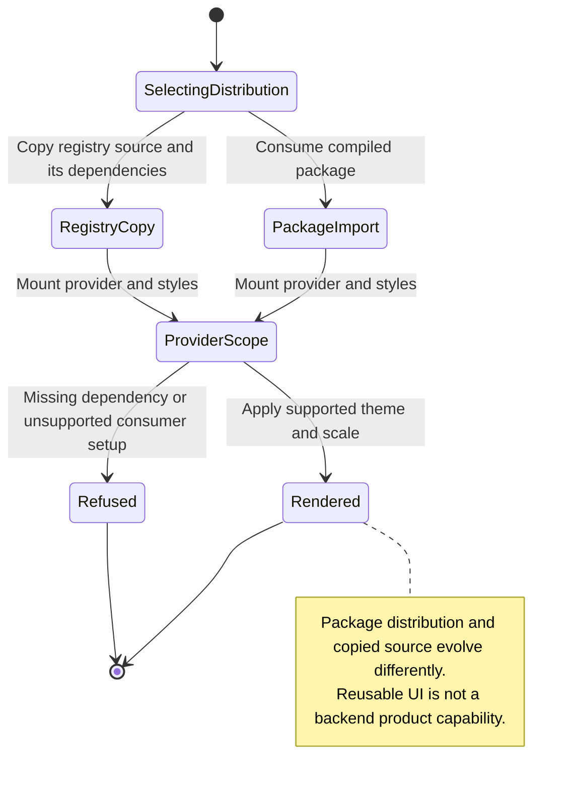

# consume UI packages or copied registry source and theme a surface

An app can use compiled Nessa UI packages or copy a component's registry source into its own code. Themes supply the appearance for the chosen surface.

The app still owns actions such as saving preferences and calling a service. A component does not add those effects by itself. Nessa uses its pinned UI revision; the sibling checkout or workshop may show a different revision.

## Further reading

[Source](../../../../../package.json) · [Related source](../../../../../scripts/ensure-nessa-ui.mjs)
