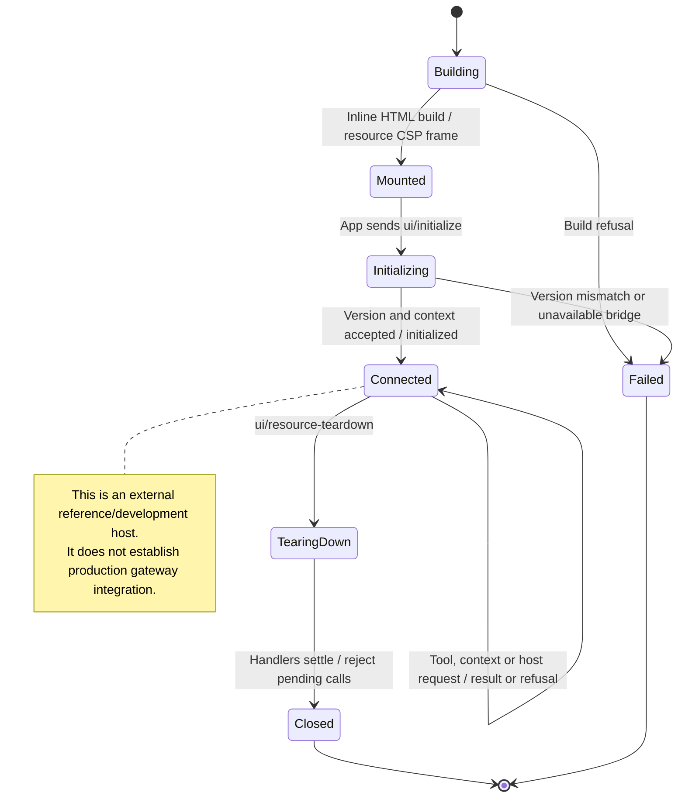

# develop an MCP App in the fake host and reference host

The fake host lets an extension developer load an app and try its messages without running the full Nessa product. The reference host exercises the app's host bridge and isolated HTML view.

These are development environments. Passing their handshake does not prove production gateway integration. Cancelling a host request does not undo a tool call already forwarded to its server.

