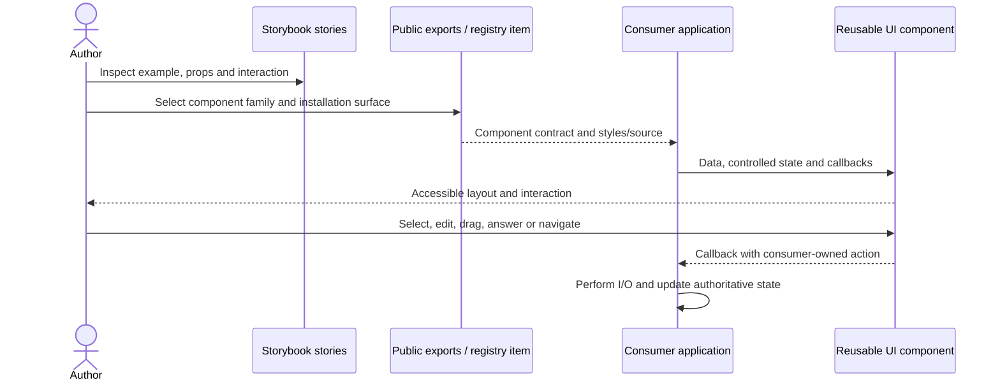

# discover reusable UI families for an application

Nessa UI groups components for common app needs such as chat, navigation, settings and agent activity. Choose a family, then use its packages or registry source in the app.

This is a component catalogue, not a list of shipped Nessa features. The consuming app supplies its data and effects. A reusable component has no independent service lifecycle just because it appears here.

