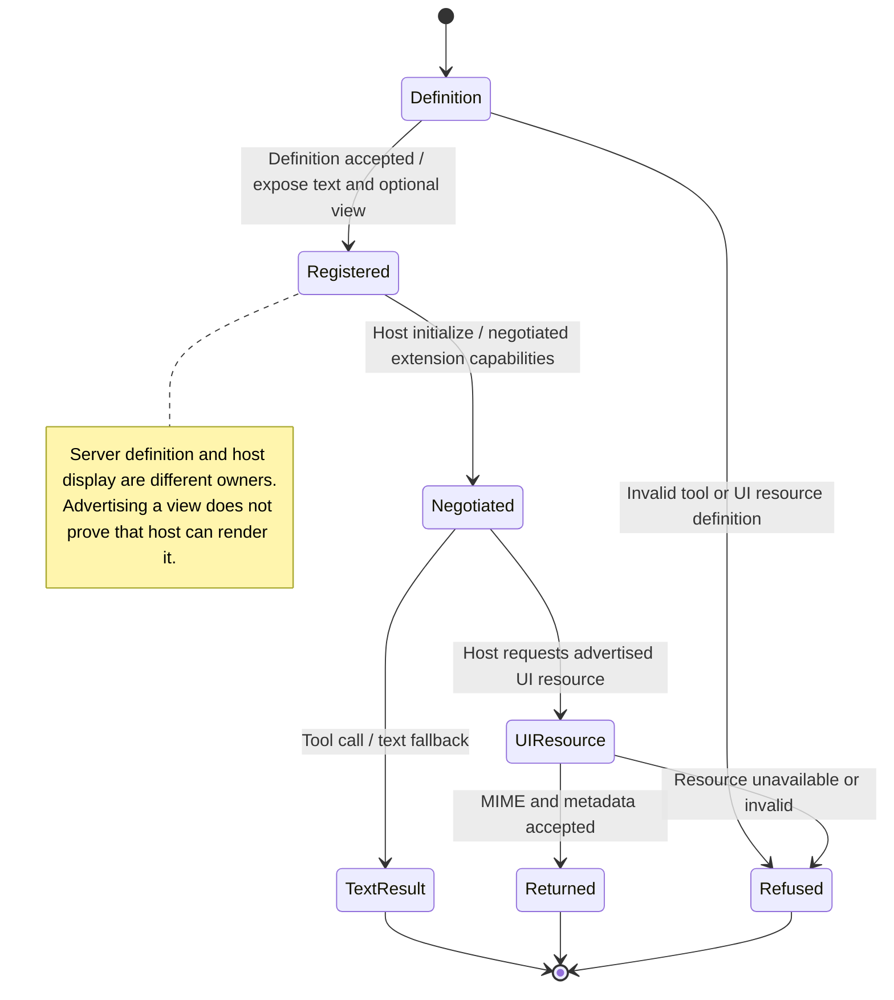

# expose an extension tool with a view and text fallback

An extension can publish a tool with both a text result and an optional interactive view. A host that supports MCP Apps can open the view; other callers can still read the text.

The server library checks tool and view definitions. It supports its documented stdio and loopback HTTP transports. Older consumers may support only stdio. The host still decides which tool calls and device permissions are allowed.

