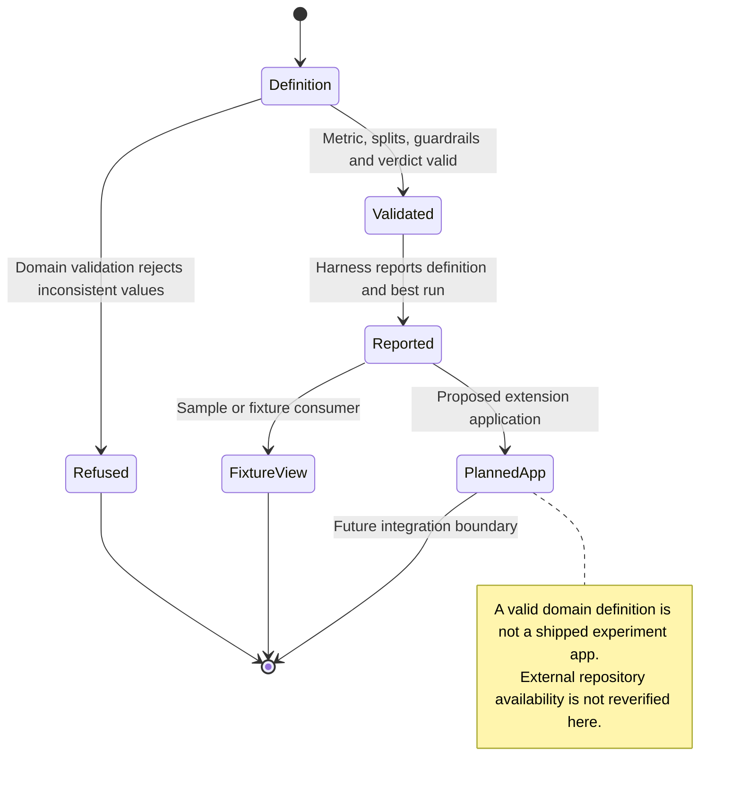

# inspect experiment results through a validated definition

An experiment definition says what is being compared and how each measure should be interpreted. Validation checks that its results match that definition before a view displays them.

A higher number is not always better. The declared direction of a measure and the recorded decision must be kept. The experiments domain and examples exist, but they do not establish a runnable production experiment app and server.

