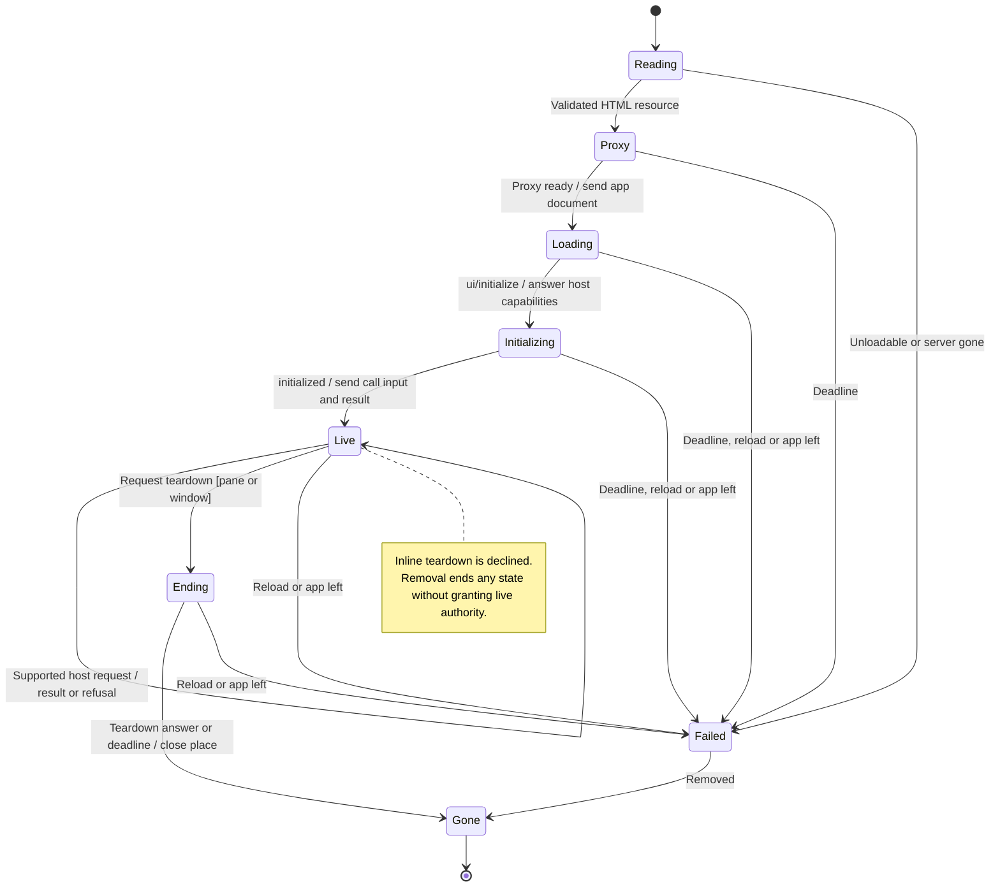

# open a tool's MCP App and interact with its host

A tool can offer an interactive MCP App alongside its result. Nessa loads the app in an isolated view and provides a bridge for allowed host interactions.

The desktop renderer, frame lifecycle and bridge work with server apps in gateway mode and a fixture in sample mode. Tool approval and device access are separate decisions; opening the view does not grant either automatically.

## Further reading

[Source](../../../../adr/done/344-mcp-ui.md) · [Related source](../../../../../src/desktop/widgets/ui/plugin.ts) · [Related tests](../../../../../src/desktop/widgets/ui/hosts.test.tsx)
