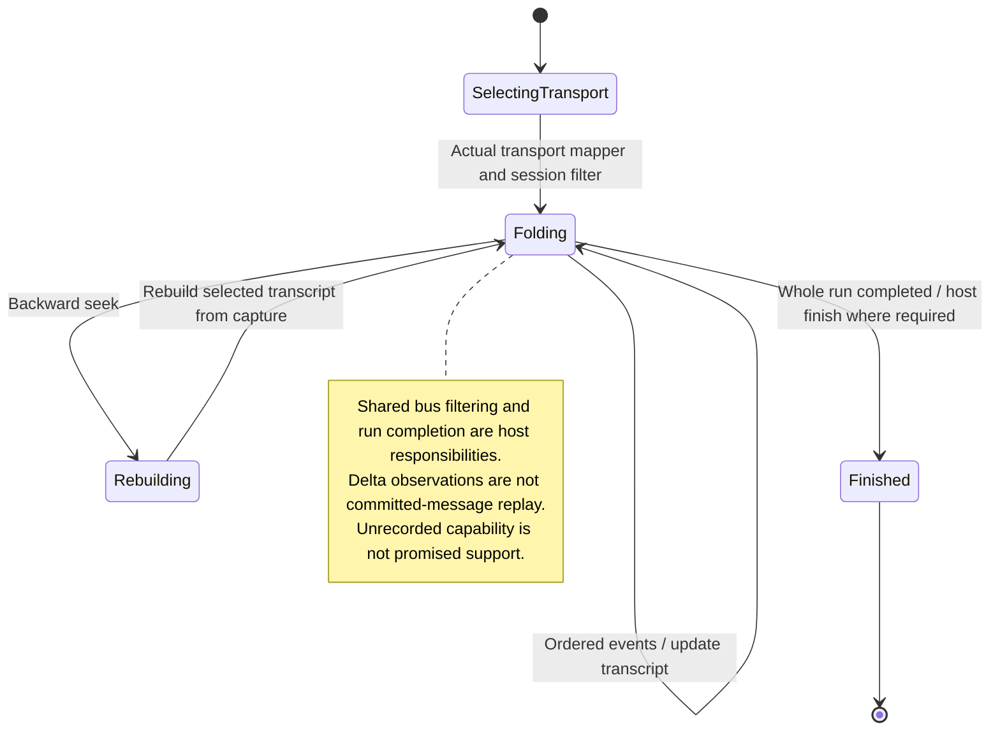

# replay or render an agent stream in the workshop or a consumer app

A stream of agent events can be replayed in the workshop or rendered by a consuming app. The parser turns those events into messages, tool activity and waiting requests for the UI.

Rendering a recorded stream does not run the agent again. The consuming app owns live transport, state and actions. Workshop examples demonstrate the component behavior rather than a production session.

