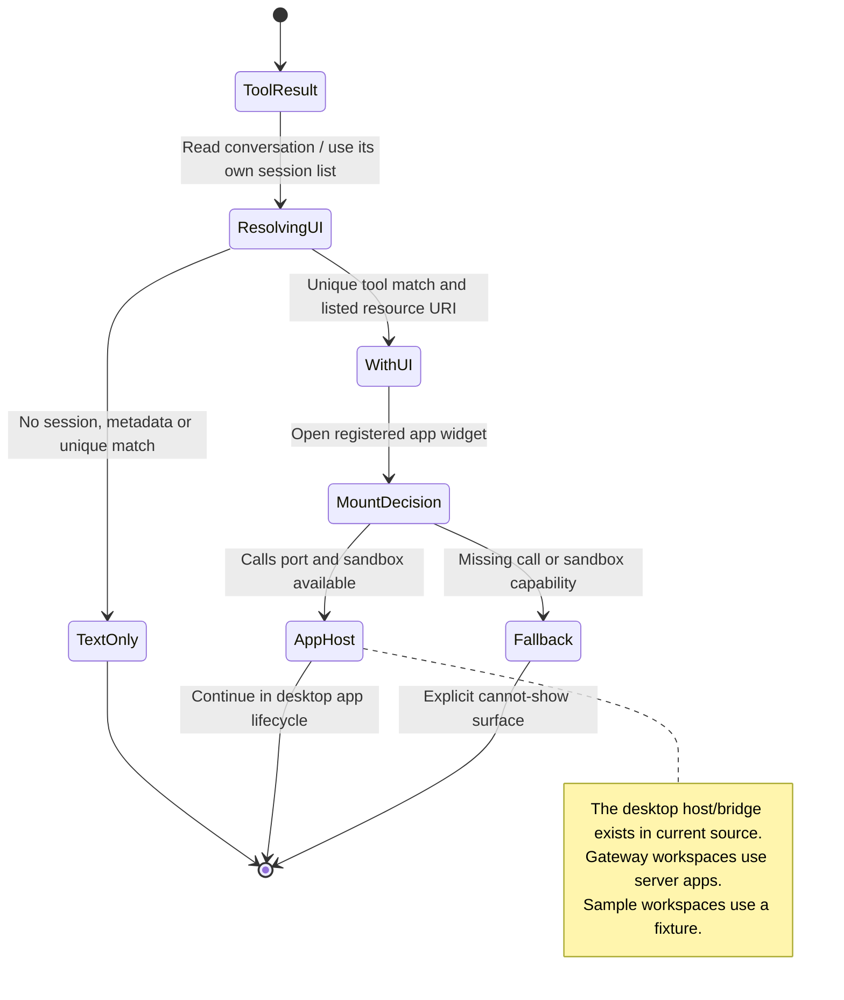

# see an MCP tool's result and discover its view

The agent's tool result can contain text and information about an interactive view. Nessa keeps the result linked to its originating tool so it can find the correct app.

Claude reports structured tool results as text. Nessa keeps the structured result forwarded by the MCP stand-in and matches it to the call and server. See [forwarded results](../../../../design/mcp-connections.md#forwarded-results).

Not every tool has a view. Tool metadata identifies an available view, but it does not prove the app loaded or that a user approved a later tool call. Those steps have separate owners.

## Further reading

[Source](../../../../design/mcp-connections.md) · [Related source](../../../../../crates/nessa-server/src/mcp_servers/mod.rs) · [Related tests](../../../../../crates/nessa-sdk/tests/domain/mcp_apps.rs)
