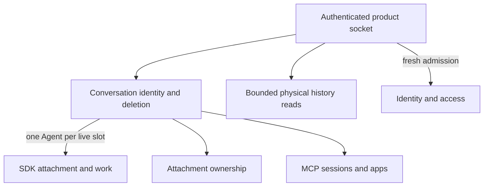

# Local gateway

The local gateway receives authenticated Nessa commands. It owns conversations, checks access and coordinates agents, stored history, images and app tool calls.

It can accept work before an agent is ready. Current views, command replies and deletion progress each describe different parts of that work.

## Owner map

These boxes open related pages. They are parts of the system, rather than mutually exclusive runtime states.

## Browse this area

- [Attachments and content](attachments/README.md)
- [Conversation identity and deletion](conversation.md)
- [Bounded physical history reads](record-reads.md)
